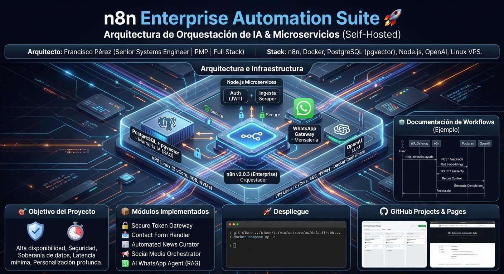

# n8n Enterprise Automation Suite 🚀
## Arquitectura de Orquestación de IA & Microservicios (Self-Hosted)



**Arquitecto:** Francisco Pérez (Senior Systems Engineer | PMP | Full Stack)
**Stack:** n8n, Docker, PostgreSQL (pgvector), Node.js, OpenAI (GPT-4o), MCP (Model Context Protocol). Linux VPS.

## 🎯 Objetivo del Proyecto
Suite de automatización empresarial de grado industrial diseñada para alta disponibilidad. Esta arquitectura trasciende el uso de simples "bots" para convertirse en un Hub de Servicios Inteligente que garantiza la soberanía de datos mediante un despliegue Self-Hosted, latencia mínima y una gestión de permisos basada en roles (RBAC) vinculada directamente a la base de datos central.

## 🏗 Arquitectura e Infraestructura (Infrastructure as Code)
Desplegado en un entorno endurecido (Hardened VPS) utilizando orquestación de contenedores y redes aisladas.

|Servicio|Tecnología|Función|
|:---|:---|:---|
|**Orquestador**|n8n v2.1.4 (Enterprise)|Motor lógico de flujos.|
|**MCP Server**|Model Context Protocol|Protocolo de interoperabilidad para ejecutar SQL desde la IA.|
|**Capa de Datos**|PostgreSQL + pgvector|Almacenamiento relacional y base de datos vectorial para RAG.|
|**Seguridad**|Node.js (JWT Service)|Microservicio dedicado para firma y validación de tokens RS256.|
|**Agentes IA**|OpenAI + LangChain Logic|Procesamiento de lenguaje natural y razonamiento autónomo.|
|**Voz (STT/TTS)**|Whisper & OpenAI TTS|Conversión bidireccional de audio con normalización de buffers.|
|**Memoria IA**|PostgreSQL + pgvector|RAG (Retrieval-Augmented Generation) para contexto a largo plazo.|
|**Ingesta**|Node.js Scraper|Motor de extracción de datos en tiempo real.|
|**Contactos**|n8n v2.1.4 (Enterprise)|Flujo para recibir informacion de prospectos en Contacto.|

## 📦 Módulos Implementados (Workflows)
1.  **🔐 Secure Token Gateway:** Gestión de autenticación API-Key/JWT centralizada.
2.  **🛠️ Contact & CRM Bridge v2 (n8n Workflow):** Sistema de captura de leads de Hosting3m.
3.  **📰 Automated News Curator:** Scraping, resumen con IA y clasificación semántica.
4.  **📢 Social Media Orchestrator:** Generación de contenido omnicanal (X, FB, LinkedIn).
5.  **🤖 AI WhatsApp Agent (RAG):** Asistente inteligente con memoria persistente en Postgres.
6.  **🛠️ Dynamic CRUD Engine:** Capa de abstracción de datos para gestión dinámica de entidades SQL.
7.  **🏨 AdminHotel Dashboard:** Cliente Web SPA para la gestión visual del inventario hotelero (Consume Módulos 01 y 06).
8.  **🤖 AI WhatsApp Agent v3 (Multi-Service Hub):** El corazón de la interacción con el cliente. Un agente multimodal que procesa texto y voz, identifica al usuario en PostgreSQL y enruta la conversación según la intención (HOSTING, HOTEL o NEUTRO).
9.  **🏨 MCP Server: Hotel Management:** Un microservicio especializado que expone "herramientas" (Tools) a la IA. Permite que el Agente del Hotel consulte disponibilidad real (habitaciones limpias y disponibles) y registre reservas directamente en la DB sin intervención humana.

## 🚀 Despliegue
```bash
# Clonar repositorio
git clone [https://github.com/tu-usuario/n8n-enterprise-suite.git](https://github.com/tu-usuario/n8n-enterprise-suite.git)

# Levantar infraestructura
cd infrastructure
docker-compose up -d

# Levantar Clientes Frontend (Opcional)
cd apps/admin-hotel
npm install && ng serve
```

---

## Documentación de Workflows Individuales

### 📦 Catálogo de Microservicios y Flujos (Workflows)

A continuación se detalla la documentación técnica y el código fuente de cada módulo implementado en n8n:

| ID | Módulo / Servicio | Función Principal | Stack & Integraciones | Documentación |
| :--- | :--- | :--- | :--- | :---: |
| `01` | **Auth JWT Gateway** 		| Middleware de seguridad. Valida tokens y protege webhooks públicos. 		| `Node.js` `Crypto` `JWT` | [📖 Ver Docs](workflows/01-auth-jwt-gateway/v1/README.md) |
| `07` | **Contact & CRM Bridge**   | Sistema de captura de leads de Hosting3m.                                 | `Webhook` `JWT` `CRUD` `Mail` `Postgres` | [📖 Ver Docs](workflows/07-contact-automated/v2/README.md) |
| `03` | **RAG News Intelligence** 	| Curaduría de noticias automatizada con análisis de sentimiento vectorial. | `Scraper` `OpenAI` `Pinecone/PgVector` | [📖 Ver Docs](workflows/03-rag-news-intelligence/v1/README.md) |
| `04` | **Omnichannel Social** 	| Orquestador de publicación de contenido en redes sociales. 				| `HTTP Request` `Twitter API` `LinkedIn` | [📖 Ver Docs](workflows/04-omnichannel-social/v2/README.md) |
| `05` | **AI WhatsApp Agent** 		| Asistente conversacional con memoria a largo plazo (RAG). 				| `WhatsApp` `Postgres` `OpenAI` | [📖 Ver Docs](workflows/05-ai-whatsapp-agent/v1/README.md) |
| `06` | **Dynamic CRUD Engine**    | Capa de abstracción para gestión de entidades dinámica.                   | `Postgre` `JS Logic` `JWT` | [📖 Ver Docs](workflows/06-dynamic-crud-engine/v2/README.md) |
| `07` | **AdminHotel Dashboard**    | Frontend administrativo para gestión de reservas y habitaciones.         | `Angular 21` `Tabler` `Vitest` | [📖 Ver Docs](app/dashboard/README.md) |
---

## 📈 Roadmap & Gestión de Proyectos (GitHub Projects V3)
**Enfoque Actual: Interoperabilidad y Eficiencia IA.**

    * Backlog (R&D): Implementación de MCP (Model Context Protocol) para interoperabilidad entre LLMs y sistemas de archivos locales.
    * En Progreso: Optimización de búsqueda HNSW en pgvector para reducir la latencia en datasets de gran escala (>1M vectores).
    * Completado (Milestones): * Despliegue de infraestructura base con redes Docker aisladas.
        * Implementación del motor CRUD dinámico para reducción de deuda técnica.

### Completado ✅:
    * Migración de RBAC estático (JS) a RBAC dinámico (PostgreSQL).
    * Pipeline de audio con Whisper y OpenAI TTS sincronizado.
    * Implementación de lógica de resiliencia para vinculación de ítems en n8n.

### En Progreso 🏗️:
    * Integración MCP: Expandiendo el catálogo de herramientas del servidor de hotel para incluir Check-out automático.
    * Optimización RAG: Implementación de índices HNSW en pgvector para búsquedas vectoriales de alta velocidad.

### Backlog (R&D) 🚀:
    * Implementación de agentes supervisores para control de calidad en respuestas automáticas.
    * Refactorización del motor de scraping para soporte de Single Page Applications (SPA).

---

Desarrollado por: Francisco Jesus Pérez Pimienta 
    - Ingeniero en Sistemas Computacionales.
    - Maestro en Administracion de Proyectos.
    - Especialista en Automatización de Procesos y Soberanía de Datos.