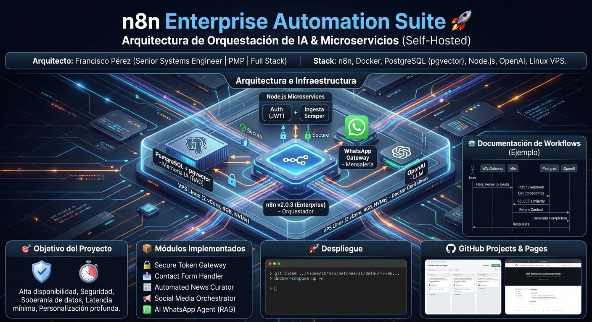

# n8n Enterprise Automation Suite 🚀
### Arquitectura de Orquestación de IA & Microservicios (Self-Hosted)



> **Arquitecto:** Francisco Pérez (Senior Systems Engineer | PMP | Full Stack)  
> **Core Stack:** n8n v2.4.6, Docker, PostgreSQL (pgvector + JSONB), Node.js, OpenAI (GPT-4o), Angular 21 (Signals).  
> **Infraestructura:** Linux VPS.

---

## 🎯 Objetivo del Proyecto

Suite de automatización empresarial de grado industrial diseñada para alta disponibilidad y escalabilidad.

La arquitectura trasciende el uso de simples "bots" para convertirse en un **Hub de Servicios Inteligente** que garantiza:

1.  **Soberanía de Datos:** Despliegue 100% Self-Hosted.
2.  **Latencia Mínima:** Optimización de redes internas Docker.
3.  **Seguridad Corporativa:** Gestión de permisos basada en roles (RBAC) y validación de tokens RS256.

---

## 🏗 Arquitectura e Infraestructura (IaC)

El ecosistema está desplegado en un entorno endurecido (**Hardened VPS**) utilizando orquestación de contenedores y redes aisladas.

| Servicio | Tecnología | Función Crítica |
| :--- | :--- | :--- |
| **Orquestador** | n8n v2.4.6 (Enterprise) | Motor lógico central de flujos y reglas de negocio. |
| **IA Bridge** | MCP Protocol | Interoperabilidad segura para que la IA ejecute SQL. |
| **Capa de Datos** | PostgreSQL + pgvector | Almacenamiento híbrido (Relacional + JSONB) y vectorial. |
| **Seguridad** | Node.js (JWT Service) | Microservicio dedicado para firma y validación de tokens RS256. |
| **Agentes IA** | OpenAI + LangChain | Procesamiento de lenguaje natural y razonamiento autónomo. |
| **Frontend Hotel** | Angular 21 SPA | Dashboard administrativo con gestión de estado reactivo (Signals). |
| **Frontend Pista** | Angular 21 PWA | WebApp progresiva para operaciones de tiempo real y cobros. |
| **Ingesta** | Node.js Scraper | Motor de extracción de datos no estructurados en tiempo real. |
| **Contactos** | n8n v2.4.6 (Enterprise) | Orquestador de entrada de leads y CRM. |

---

## 📦 Módulos Implementados (Workflows)

La suite se compone de 9 módulos principales que operan como microservicios interconectados:

### 1. 🔐 Secure Token Gateway
Sistema centralizado de **Gestión de Identidad**. Administra la validación de peticiones externas y la auto-generación de tokens para tareas cronometradas bajo un esquema "Zero Trust".

### 2. 🛠️ Contact & CRM Bridge v2
Orquestador de entrada de leads. Realiza validación estricta de tipos y sanitización de datos antes de la persistencia en el CRM.

### 3. 📰 Automated News Curator
Motor de inteligencia competitiva. Extrae noticias técnicas, realiza un **filtrado semántico** y genera una identidad visual única mediante IA generativa.

### 4. 📢 Social Media Orchestrator
Orquestador omnicanal con lógica de **idempotencia**. Verifica cuotas de publicación diarias y adapta el contenido para X, Facebook y LinkedIn.

### 5. 🤖 Multi-Service WhatsApp Hub
Agente multimodal (Texto/Voz) con **enrutamiento inteligente**. Identifica al cliente en la DB y decide si la atención debe ser orientada a Hosting, Hotel o soporte general, utilizando memoria persistente `pgvector`.

### 6. 🛠️ Dynamic CRUD Engine
Capa de abstracción SQL que actúa como un **Backend as a Service (BaaS)** unificado.
* **Novedad v3:** Soporte para persistencia híbrida (SQL para búsquedas rápidas + JSONB para esquemas flexibles).

### 7. 🏨 MCP Server: Hotel Management
Implementación avanzada del **Model Context Protocol**. Expone herramientas de base de datos a la IA, permitiendo consultas de inventario en tiempo real mediante lenguaje natural.

### 8. 🏨 AdminHotel Dashboard (v0.7)
Cliente Web SPA para la gestión hotelera integral.
* **Core:** Angular 21 + Tabler UI.
* **Módulo QA:** Nuevo sistema de **Rondines** con formularios dinámicos y "Smart Merge" de datos JSONB.
* **Room Rack:** Semáforo visual de estados (Sucia, Disponible, Ocupada).
* **Finance:** Auditoría de fugas y descuentos dinámicos.

### 9. ⛸️ PistaHielo Operations Center (v0.6)
PWA Administrativa para la gestión de centros de entretenimiento.
* **Core:** Angular 21 + Reactive Signals.
* **Dual-Stage Billing:** Motor de cobro de alta precisión con soporte para **"Midnight Crossing"** (turnos que cruzan la medianoche).
* **Ops:** Monitoreo en tiempo real y reportes de Corte Z (Efectivo vs Tarjeta).

---

## 🚀 Despliegue Rápido

```bash
# 1. Clonar repositorio
git clone [https://github.com/tu-usuario/n8n-enterprise-suite.git](https://github.com/tu-usuario/n8n-enterprise-suite.git)

# 2. Levantar infraestructura Backend
cd infrastructure
docker-compose up -d

# 3. Levantar Clientes Frontend (Ejemplo)
cd apps/admin-hotel
npm install && ng serve

```

---

## Documentación de Workflows Individuales

### 📚 Documentación Técnica por Módulo

| ID | Módulo / Servicio | Función Principal | Stack & Integraciones | Documentación |
| :---| :--- | :--- | :--- | :---: |
| `01`|**Auth JWT Gateway**| Middleware de seguridad. Valida tokens y protege webhooks públicos.| `Node.js` `Crypto` `JWT` | [📖 Ver Docs](workflows/01-auth-jwt-gateway/v3/README.md)|
| `02`|**Contact & CRM Bridge**|Sistema de captura de leads de Hosting3m.|`Webhook` `JWT` `CRUD` `Mail` `Postgres`|[📖 Ver Docs](workflows/02-leads-contact/v3/README.md)|
| `03`|**RAG News Intelligence**|Curaduría de noticias automatizada con análisis de sentimiento vectorial.|`Scraper` `OpenAI` `Pinecone/PgVector`|[📖 Ver Docs](workflows/03-rag-news-intelligence/v3/README.md)|
| `04`|**Omnichannel Social**|Orquestador de publicación de contenido en redes sociales.|`HTTP Request` `Twitter API` `LinkedIn`|[📖 Ver Docs](workflows/04-omnichannel-social/v3/README.md)|
| `05`|**AI WhatsApp Agent**|Asistente conversacional con memoria a largo plazo (RAG).|`WhatsApp` `Postgres` `OpenAI`|[📖 Ver Docs](workflows/05-ai-whatsapp-agent/v3/README.md)|
| `06`|**Dynamic CRUD Engine**|Capa de abstracción para gestión de entidades dinámica.|`Postgre` `JS Logic` `JWT`|[📖 Ver Docs](workflows/06-dynamic-crud-engine/v3/README.md)|
| `07`|**MCP Server**| MCP Server: Hotel Management Core|`MCP` `Postgres` `OpenAI`|[📖 Ver Docs](workflows/07-MCP-server-hotel/v2/README.md)|
| `08`|**AdminHotel Dashboard**|Frontend administrativo para gestión de reservas y habitaciones.|`Angular 21` `Tabler` `Vitest`|[📖 Ver Docs](hosting3m-workspace/projects/dashboard/README.md)|
| `09`|**PistaHielo Ops Center**|PWA para gestión de rentas por tiempo y cortes de caja.|`Angular 21` `Signals` `PWA`|[📖 Ver Docs](hosting3m-workspace/projects/pista-hielo/README.md)|
| `10`|**Shared AI Chat Lib**|Librería agnóstica de chat IA reutilizable con configuración dinámica.|`Angular 21` `InjectionToken`|[📖 Ver Docs](hosting3m-workspace/projects/ui-chat/README.md)|
---

## 📈 Roadmap & Gestión de Proyectos

Seguimiento del ciclo de vida del desarrollo.

### ✅ Completado (Q4 2025 - Q1 2026)

* [x] **Infraestructura:** Despliegue de redes Docker aisladas y Auth Gateway RS256.
* [x] **Hotel Core:** Dashboard v0.7 con Módulo de Calidad (Rondines) y persistencia híbrida.
* [x] **Pista Hielo:** PWA v0.6 con corrección de cálculo de tiempos (Midnight Bug) y reportes financieros.
* [x] **Backend:** Dynamic CRUD Engine v3 con soporte nativo para JSONB.

### 🏗️ En Progreso (Q2 2026)

* [ ] **PistaHielo Membership:** Integración de directorio de alumnos VIP y control de mensualidades.
* [ ] **Optimización RAG:** Migración a índices HNSW en pgvector para búsquedas masivas de latencia baja.

### 🚀 Backlog & R&D (Futuro)

* [ ] **Agentes Supervisores:** IA de control de calidad para auditar respuestas de bots.
* [ ] **Auto-Checkout MCP:** Procesamiento de pagos automatizados mediante IA.

---
Desarrollado por: **Francisco Jesus Pérez Pimienta**

* Ingeniero en Sistemas Computacionales | PMP | Full Stack.
* Especialista en Automatización de Procesos y Soberanía de Datos.
