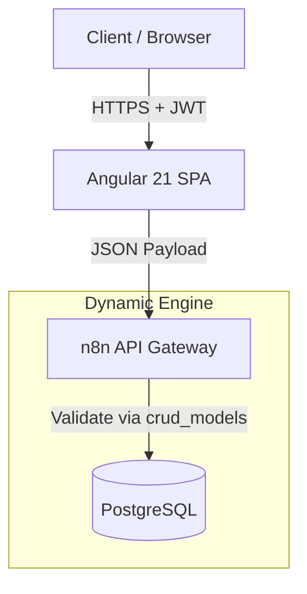

# 🏛️ Architecture Overview: AdminHotel Dashboard

## 📝 Descripción
**Project:** AdminHotel Dashboard (Hosting3M Automation Suite)  
**Version:** v0.5 (Latest)  
**Stack:** Angular 21 (Signals) | n8n (API Gateway) | PostgreSQL (Persistence)  
**Author:** Francisco Jesus Pérez Pimienta

**AdminHotel Dashboard** es una aplicación web de alto rendimiento construida sobre Angular 21, diseñada como la interfaz administrativa oficial de la suite de automatización Hosting3M.

## 1. High-Level Design (The "Big Picture")
El sistema sigue una arquitectura **Data-Access Service Pattern** altamente desacoplada. El frontend no contiene lógica SQL ni reglas de negocio complejas del lado del servidor; actúa como un cliente inteligente que consume un **Dynamic CRUD Engine**.



### Principios Clave:
1. Smart Services / Dumb Components: Los componentes (.ts) solo gestionan el estado de la vista (viewMode). La lógica de negocio y las llamadas a la API residen estrictamente en los servicios (feature/services).

2. Meta-Driven Backend: La API no está "hardcodeada". n8n consulta la tabla crud_models para saber qué campos son requeridos, qué roles tienen permiso y qué validaciones aplicar en tiempo real.

3. Reactivity First: Uso intensivo de Angular Signals para el manejo de estado, eliminando la necesidad de librerías externas como NgRx para este alcance.

---

## 2. Frontend Structure (Modular Architecture)
La aplicación sigue una estructura basada en Features (Funcionalidades), agrupando lógica por dominio en lugar de por tipo de archivo.

📂 src/app/core (The Singleton Layer)
Contiene elementos que se instancian una sola vez y son transversales a toda la app.
    * Auth: auth.interceptor (inyecta JWT), auth.guard (protección de rutas).
    * Models: Interfaces globales (hotel.types.ts, api-response).
    * Services: AuthService (manejo de sesión).

📂 src/app/features (Domain Logic)
Aquí vive el negocio. Cada carpeta es un módulo autocontenido.
| Feature| Responsabilidad | Componentes Clave | Servicios |
| Booking | Ciclo de vida de la reserva. | Reservation|Manager (Orquestador), ReservationForm, CheckinForm. | BookingService (Disponibilidad, Check-in). |
| Dashboard | Vista operativa principal. | RoomCard (Estado visual), RoomFilters. | HotelService (Estado global de habitaciones). |
| AdminGestión de entidades. | GuestList, UserList (Skeletons & Tables). | AdminService (CRUD genérico para admin).FinanceReportes y métricas.DailyReportModal. |ReportService (Cálculos financieros). |

📂 src/app/shared (Reusability)
    * UI: SkeletonComponent (Feedback de carga), Modales genéricos.
    * Services: DateUtilsService (Normalización de fechas para evitar errores de zona horaria).

---

## 3. The Data Layer: Dynamic CRUD Engine
El backend no es una API REST tradicional. Es un motor transaccional basado en operaciones.

**Protocolo de Comunicación**
El frontend envía payloads estandarizados a */crud/v2/:model*:

JSON
```
{
  "operation": "insert", // Opciones: select, insert, update, delete, getall
  "fields": {
    "check_in": "2026-01-24",
    "room_id": 14,
    "status": "confirmed"
  }
}
```

**La Tabla** *crud_models* **(The Brain)**
En PostgreSQL, la tabla *crud_models* define la "Constitución" del sistema. Antes de ejecutar cualquier query, n8n verifica:

    1. *allowed_fields*: ¿El campo que intenta guardar el frontend existe en este array?
    2. *schema_json*: ¿El tipo de dato es correcto? (e.g., *price_night* debe ser *number*).
    3. *allowed_roles_...*: ¿El usuario con rol *EDITOR* tiene permiso para *DELETE* en la tabla *users*? (La respuesta es NO, según la DB).

---

## 4. Database Schema & Relationships
El modelo relacional está optimizado para integridad referencial y auditoría.

**Entidades Principales (** *public* **schema)**
    * companys (Tenant): Tabla raíz. Todo registro (id_company) pertenece a una empresa, permitiendo multi-tenancy futuro.
    * hotel_rooms: Inventario físico.
        * Constraint: room_number es único.
        * Estado: Controlado por status (available, occupied, maintenance) y cleaning_status.

    * hotel_guests: Identidad del cliente.
        *Constraint: doc_id y email únicos. Evita duplicados.

    * hotel_bookings: El nexo transaccional.
        * FKs: Vincula room_id y guest_id.
        * Inventory: Columnas booleanas (inventory_tv_ok, etc.) para control de activos en check-out.

**Lógica de Disponibilidad (Time-Overlap)**
La base de datos y el servicio de Booking utilizan la lógica de Intervalos Abiertos para permitir la rotación de habitaciones el mismo día:
    Una habitación está disponible si NO existe una reserva donde: (NewStart < ExistingEnd) AND (NewEnd > ExistingStart)

---

## 5. Key Workflows & Patterns
**A. Pattern: Reservation Manager (Orchestrator)**
Separación de responsabilidades para la gestión de reservas:
    1. *Manager* (ReservationManagerComponent): Componente "inteligente". Maneja la paginación, el filtrado (Global vs. Por Habitación) y la tabla de datos.
    2. *Form* (ReservationFormComponent): Componente de presentación. Maneja la validación de fechas, cálculo de precios y captura de datos.
    3. *Communication*: Uso de @Input y @Output para pasar datos. El Manager le dice al Form qué editar; el Form le avisa al Manager cuando guardó para refrescar la lista.

**B. Pattern: Reactive State (Signals)**
En lugar de Observables complejos para el estado de la UI, se utilizan Signals:

TypeScript
```
// Ejemplo en DashboardComponent
viewMode = signal<'details' | 'reservation' | ...>('details');
// La UI reacciona instantáneamente:
@if (viewMode() === 'reservation') { ... }
```

**C. Security Flow**
    1. Login: El usuario recibe un JWT con su role (ADMIN, EDITOR).
    2. Request: El AuthInterceptor adjunta el token en el header.
    3. Validation:
        * **Frontend**: *AuthGuard* protege rutas.
        * **Backend**: n8n decodifica el JWT y compara el *role* contra la columna *allowed_roles* en *crud_models*.

## 6. Future Scalability
    * WhatsApp AI Agent: La tabla crud_models ya tiene permisos para un rol bot, preparando el terreno para inserciones automáticas.
    * Multi-Tenant: La columna id_company está presente en todas las tablas, permitiendo escalar a múltiples hoteles con la misma instancia.

Document generated regarding the v0.5 codebase state.