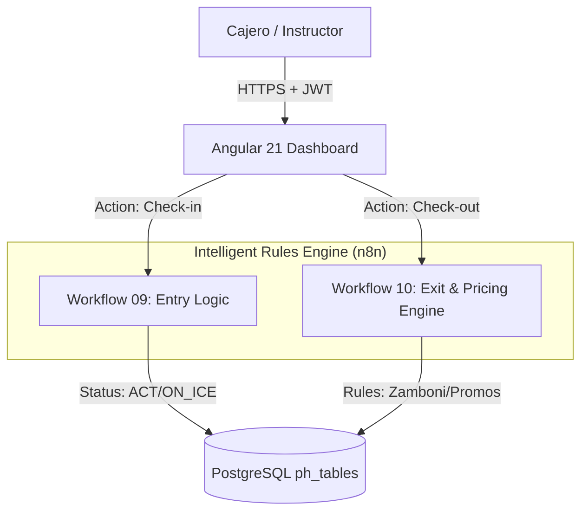

# ⛸️ Architecture Overview: PistaHielo Operations Center

## 📝 Descripción
**Project:** PistaHielo Dashboard (Módulo de la Suite Hosting3M)
**Version:** v0.1 (Enterprise Ready)
**Stack:** Angular 21 (Signals) | n8n v2.1.4 (Orquestador) | PostgreSQL (pgvector) | Docker
**Patrón Arquitectónico:** Event-Driven State Machine (Check-in/Check-out Logic).
**Author:** Francisco Jesus Pérez Pimienta

**Pista de Hielo** es una aplicación web de alto rendimiento construida sobre Angular 21, diseñada como la interfaz administrativa oficial de la suite de automatización Hosting3M.

## 1. Diseño de Alto Nivel: El "Motor de Tiempos"
A diferencia de un hotel donde las estancias son por días, la Pista de Hielo opera en minutos y segundos. La arquitectura se centra en una Máquina de Estados Transaccional gestionada por n8n.

### Principios Clave:
1. **Dual-Time Operation Pattern:** Separación estricta entre la creación del registro (Tiempo 1) y el cierre contable (Tiempo 2).

2. **Server-Side Pricing Engine:** El frontend no calcula precios. Envía el contexto (id_patin, id_cliente, flags) y n8n devuelve el monto final aplicando lógica de costo.class.php.

3. **Real-Time "Ice Rack":** Uso de Signals para monitorear quién está en la pista en tiempo real, similar al "Room Rack" del hotel.

---

## 2. Frontend Structure (Modular Architecture)
La aplicación sigue una estructura basada en Features (Funcionalidades), agrupando lógica por dominio en lugar de por tipo de archivo.

📂 src/app/core (The Singleton Layer)
Contiene elementos que se instancian una sola vez y son transversales a toda la app.
    * Auth: auth.interceptor (inyecta JWT), auth.guard (protección de rutas).
    * Models: Interfaces globales (hotel.types.ts, api-response).
    * Services: AuthService (manejo de sesión).

📂 src/app/features/pista
Aquí vive el negocio. Cada carpeta es un módulo autocontenido.

| Sub-Módulo | Responsabilidad | Componente Clave | 
| :--- | :--- | :--- | 
| Operations | El "Ice Rack". Vista de patinadores activos. | IceLiveMonitor (Lista reactiva), SkateAssignmentForm. | 
| POS (Punto de Venta) | Venta retail y cobro de membresías VIP. | TransactionManager, MemberSearch (Autocomplete). | 
| Closures | Gestión de Corte X y Corte Y/Z. | ClosureHistory, DailyBalanceModal. |

📂 src/app/shared (Reusability)
    * UI: SkeletonComponent (Feedback de carga), Modales genéricos.
    * Services: DateUtilsService (Normalización de fechas para evitar errores de zona horaria).

---

## 3. Capa de Negocio: Workflows de n8n Especializados
Para PistaHielo, extenderemos el Dynamic CRUD Engine con dos sub-flujos de lógica pesada (reemplazando a las clases PHP):

**Workflow 09:** ph-checkin-processor
    * Trigger: Webhook desde Angular.
    * Lógica: 1. Valida disponibilidad de patín (ph_inventory). 2. Si es ALUMNO, verifica membership_expiry. 3. Registra start_time en ph_transactions.
    * Output: Confirmación y generación de ticket de entrada.

**Workflow 10:** ph-checkout-pricing-engine
    * Trigger: Acción de "Cierre" desde el Dashboard.
    * Lógica de Ingeniería:
        1. Calcula delta de tiempo (end_time - start_time).
        2. Filtro Zamboni: Resta automáticamente 15 min si el flag zamboni es TRUE.
        3. Promotions Engine: Aplica lógica de Hermanos (20%/30% desc) si hay múltiples IDs vinculados.
        4. Saneamiento: Registra el pago en ph_payments con el ID del Corte X actual.

---

## 4. Modelo de Datos (PostgreSQL Schema)
Aprovechando la migración que realizamos hoy, la base de datos es el ancla de la soberanía de datos:

**Entidades Principales (** *public* **schema)**
    * **ph_clients:** Maestro de identidades con soporte para membership_expiry y is_vip.
    * **ph_inventory:** Control dual de consumibles (venta) y activos (renta de patines).
    * **ph_transactions:** El log de actividad con estados ACT, PAG, CAN.
    * **ph_payments:** El flujo de efectivo real para auditoría.
    * **ph_closures:** El control jerárquico de Cortes X e Y.

---

## 5. Integración con la Suite n8n Enterprise (IA & WhatsApp)
Como experto en IA, esta arquitectura habilita casos de uso avanzados:
Separación de responsabilidades para la gestión de reservas:
    1. **WhatsApp Bot (Módulo 05):** Un padre de familia puede preguntar: "¿A qué hora sale mi hijo de la pista?". El agente de IA usa el MCP para consultar ph_transactions y responder en tiempo real.

    2. **Notificaciones Proactivas:** n8n monitorea ph_clients y envía un mensaje automático vía WhatsApp 3 días antes de que venza la mensualidad del alumno.

    3. **Análisis Predictivo:** Uso de los datos históricos para predecir cuántos patines de cada número se necesitarán en un sábado de alta afluencia.

## 6. 📈 Roadmap de Implementación
    Fase 1: Core Operativo (Semana 1)
        * Despliegue de los componentes de Angular: IceLiveMonitor y EntryForm.
        * Activación de los Workflows de n8n para Check-in/Check-out.

    Fase 2: Administración y Cierres (Semana 2)
        * Módulo de ph_closures para automatizar los Cortes X e Y.
        * Integración del sistema de "Clave de Supervisor" mediante roles de JWT (RBAC).
        * Fase 3: IA & Analytics (Futuro)
        * Dashboard de analítica sobre rentabilidad por hora y ocupación de pista.

Document generated regarding the v0.1 codebase state.