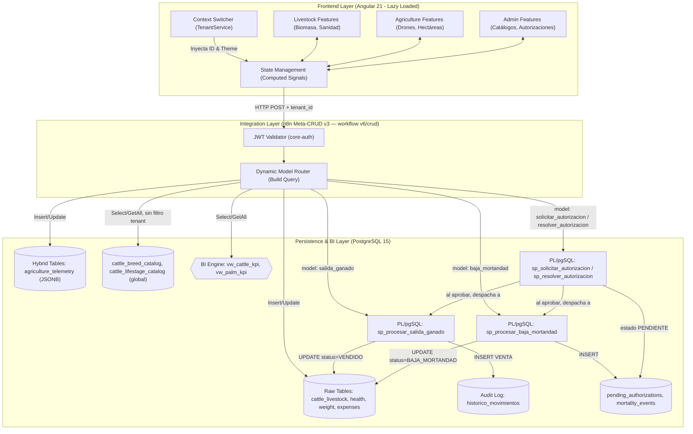

# 🏛️ Architecture Specification & Meta-CRUD Engine Blueprint

## 📝 Descripción

**Project:** Hosting3M Automation Suite (Agro ERP)
**Version:** v1.12.0 (Untagged-Animal Event Reporting, Async Authorization Subsystem, Global Parametrization Catalogs, Birth Event MCP Tool)
**Stack:** Angular 21 (Signals) | n8n (API Gateway / MCP) | PostgreSQL (JSONB, Views & PL/pgSQL) | Tabler UI
**Author:** Francisco Jesus Pérez Pimienta

**Historial de versiones documentado en este archivo:**
- v1.8.0 — Multi-Domain, Hybrid Telemetry & PL/pgSQL Engine (línea base original)
- v1.9.0 (2026-07-27 a 2026-07-29) — Regulatory Registry Subsystem; hallazgos de producción
  sobre `execute_metacrud_write` y el contrato implícito del motor Meta-CRUD
- v1.10.0 (2026-08-10 a 2026-08-14) — Movement & Compliance-Document Subsystem; endurecimiento
  de seguridad de `upload-file`
- v1.11.0 (2026-07-23 a 2026-09-11) — Global Parametrization Catalogs; Async Authorization
  Subsystem para `BAJA_MORTANDAD` y `VENTA` iniciada por Agente IA; correcciones al gateway
  Meta-CRUD para tablas globales
- v1.11.1 (2026-09-16) — Herramienta MCP `register_birth_event` validada en producción;
  fixes de tipado UUID y de payload de autorización; confirmación de edad de madurez
  `BECERRO_TORETE`; hallazgos de resolución de UPP y de reporte de mortandad sin
  identificador
- v1.12.0 (2026-09-18 a 2026-09-19) — Reporte de mortandad/venta para animales sin
  identificador físico (`find_calf_by_dam`, `livestock_id` end-to-end en toda la cadena de
  autorización asíncrona); hallazgo y corrección de un caso real de incumplimiento de
  aislamiento multi-tenant en el Agente IA (tenant_id ignorado pese a estar correctamente
  resuelto en contexto); documentación retroactiva del overload de 4 parámetros de
  `sp_procesar_salida_ganado`

## 📝 1. Estructura del Workspace (Feature-Driven Architecture)

El frontend está desarrollado sobre un Monorepo en Angular 21 utilizando una arquitectura orientada a características (*Feature-Driven*), diseñada para un aislamiento estricto de dominios de negocio y carga perezosa (*Lazy Loading*)[cite: 1, 4].

```text
├── apps/
│   └── agro-erp/                       # Aplicación unificada Multi-Dominio[cite: 3, 4]
│       ├── src/
│       │   ├── app/
│       │   │   ├── core/               # Singletons globales (TenantService, Interceptors)[cite: 1, 4]
│       │   │   ├── features/           # Dominios Operativos Completamente Aislados[cite: 1, 4]
│       │   │   │   ├── agriculture/    # Módulo Palma (Telemetría, Drones, Hectáreas)[cite: 2, 4]
│       │   │   │   ├── livestock/      # Módulo Ganadero (Biomasa, Sanidad, Pesajes)[cite: 3, 4]
│       │   │   │   └── admin/          # Catálogos globales, Autorizaciones Pendientes (v1.11.0)
│       │   │   ├── shared/             # Componentes UI reutilizables comunes
│       │   │   ├── app.config.ts       # Configuración global del Core de Angular
│       │   │   └── app.routes.ts       # Enrutamiento con Lazy Loading Dinámico[cite: 1, 4]
│       │   └── styles/
│       │       ├── themes/             # SCSS Reactivo (theme-cattle.scss / theme-palm.scss)[cite: 1, 4]
│       │       └── main.scss
│
├── libs/
│   └── core-auth/                      # Librería compartida de Autenticación y RBAC[cite: 1, 4]
│
├── infrastructure/
│   └── upload-file/                    # Microservicio propio de almacenamiento de archivos
│                                        # ("Sovereign Media Service"). Ver sección 5.
│
├── workflows/                          # Orquestación de Backend y Agentes de IA en n8n[cite: 1]
│   └── 09-MCP-Agent-Cattle/            # Configuración de Servidores MCP y Captura de Campo[cite: 4]

```

---

## ⚙️ 2. Especificación Técnica del Motor Meta-CRUD (`crud_models`)

El sistema implementa el patrón **Meta-CRUD v3**, donde la lógica transaccional, validaciones y permisos no residen en controladores de código del backend, sino que son interpretados en tiempo de ejecución por el API Gateway de **n8n** (workflow **`v6/crud`**, renombrado desde `06-dynamic-crud-engine` — mismo workflow, confirmado 2026-09-11) a través del diccionario de metadatos de la tabla `crud_models`.

### 🔄 Diagrama de Flujo del Runtime Meta-CRUD



### ⚠️ Contrato del motor Meta-CRUD (restricciones implícitas, no declaradas en `crud_models`)

*Añadido en v1.9.0, extendido en v1.11.0.* Restricciones que el gateway impone en runtime y que no aparecen en ningún esquema ni
documentación previa. Cada una costó una ronda de depuración en producción antes de
identificarse.

**1. Toda tabla o vista registrada debe exponer `created_at`.**
El gateway lo usa para el `ORDER BY` por defecto de `getall`. Omitirlo produce, en tiempo de
ejecución (no en el despliegue):
```
{"error":true,"message":"column vw_upp_compliance_status.created_at does not exist"}
```
Corregido para las vistas de cumplimiento en la migración 021, tras detectarse ya en
producción con el módulo desplegado.

**2. Shape exacto del payload.** El modelo va en la URL **y** en el body:
```json
{ "entity": "<model>", "table_name": "<table>", "operation": "getall|getone|insert|update",
  "filters": { }, "fields": { }, "id": "<pk>" }
```
Las operaciones van en minúsculas. Un payload con otra forma (por ejemplo, con
`"operacion"` en español o sin `"entity"`) devuelve **HTTP 200 con cuerpo vacío**, sin
ningún indicio de error. Esto llevó a diagnosticar erróneamente un "bug crítico de
`allowed_fields`" que resultó ser, simplemente, un payload de prueba mal formado.

**3. Las colecciones vacías devuelven `data:[{}]`, no `[]`.** Verificado contra
`cattle_breed_catalog` con 0 filas reales: la UI mostraba "1/1 razas" con una tarjeta en
blanco. Cualquier consumidor debe filtrar por la clave primaria esperada antes de contar o
renderizar — un `Object.keys().length === 0` no basta, porque el objeto fantasma puede traer
claves con valor `null`.

**4. Los errores de PostgreSQL llegan como HTTP 200 con `error:true` y el mensaje real**
(ej. violación de CHECK). El "MetaCRUD Silent Error Shield" del frontend es la mitigación
correcta a este comportamiento del gateway, no un patrón defensivo redundante.

**5. `tenant_id` solo se inyecta si el modelo lo declara.** *Añadido en v1.11.0.* El nodo
Build Query agregaba `WHERE tabla.tenant_id = $1` a **cualquier** `GETALL`, sin verificar si
la tabla tenía esa columna — descubierto al desplegar `cattle_breed_catalog` (primer
catálogo global del proyecto), que fallaba con
`column cattle_breed_catalog.tenant_id does not exist`. Corregido condicionando la
inyección a `config.allowed_fields.includes('tenant_id')`. Cualquier tabla global futura
(sin `tenant_id`) depende de este fix.

**6. `sp_requires_tenant` en `crud_models`.** *Añadido en v1.11.0.* Columna BOOLEAN, default
`true`, que el gateway consulta antes de exigir el header `x-tenant-id` en una invocación
`call_sp`. Necesaria para procedimientos como `sp_resolver_autorizacion`, que no reciben
`tenant_id` como parámetro (la validación de tenant ya ocurrió al crear la solicitud
original).

### 📋 Anatomía de Campos del Motor Dinámico

Basado en la telemetría actual registrada en la base de datos `hosting3m_db`, cada registro del Meta-CRUD se compone de:

1. **`model_name` & `table_name`:** Identificadores lógicos y físicos de la entidad en PostgreSQL.
2. **`allowed_fields`:** Arreglo estricto de columnas permitidas en mutaciones (Filtro de seguridad contra inyecciones de parámetros).
3. **`schema_json`:** Validador de tipos y campos obligatorios en el *Runtime*. Convierte tipos de datos de payloads débiles (strings de la IA/Frontend) a tipos fuertemente tipados en Postgres.
4. **`allowed_ops`:** Restringe las operaciones HTTP/CRUD permitidas para el modelo (ej. `SELECT, INSERT, UPDATE, DELETE, GETONE, GETALL`).
5. **`hooks`:** Micro-orquestaciones (`pre` y `post`) ejecutadas antes o después de la transacción (ej. disparar un webhook de alerta en mortalidad).
6. **`allowed_roles_*`:** Matriz de Control de Acceso Basado en Roles (RBAC) evaluada en caliente por el Interceptor de Seguridad.
7. **`joins`:** Definición declarativa de hidratación relacional. Permite inyectar datos de tablas padre sin que el cliente Frontend construya consultas complejas.
8. **`sp_requires_tenant`** *(añadido en v1.11.0)*: BOOLEAN, default `true`. Solo relevante para modelos `call_sp` — ver contrato punto 6 arriba.

#### ⚠️ Hallazgos confirmados sobre `execute_metacrud_write` (2026-07-27)

*Añadido en v1.9.0.* Esta función existe en la base pero **no es la ruta real de escritura del gateway**.
Confirmado mediante prueba directa:

```sql
SELECT execute_metacrud_write('UPDATE','cattle_livestock','{"tb_test_date":"2026-07-20"}'::jsonb, 1);
-- {"status": "error", "message": "invalid input syntax for type uuid: \"1\""}
```

Tres defectos verificados:
1. **`p_record_id` es `integer`**, incompatible con cualquier tabla de PK UUID —
   es decir, todas las tablas `cattle_*` y todas las del registro normativo.
2. **`WHERE id = %L` está hardcodeado**, ignorando `crud_models.primary_key`. Nunca pudo
   actualizar `companys` (PK real: `id_company`).
3. `RETURNING to_jsonb(*)` es sintaxis inválida sin alias de tabla — cualquier INSERT/UPDATE
   que la alcance cae en el `EXCEPTION WHEN OTHERS` y responde `status:error` con HTTP 200.

**Confirmado por contraste:** el gateway sí escribe correctamente contra tablas de PK UUID
(prueba real: `UPDATE cattle_livestock` con `id` UUID via el endpoint `crud/v5`, exitoso).
Esto significa que el nodo **Build Query** del workflow **`v6/crud`** construye
su propio SQL dinámicamente y no invoca esta función — `execute_metacrud_write` es un
vestigio parcial, probablemente usado solo por flujos anteriores al módulo agropecuario
(hotel/pista de hielo). No asumir que es la ruta de escritura sin verificarlo primero contra
el workflow real.

---

## 📊 3. Modelos Operativos Registrados (Módulo Ganadero)

A continuación se detalla el comportamiento del motor para los modelos vigentes extraídos del sistema:

### 🐾 Modelo: `cattle_livestock` (ID: 37)

* **Permisos de Operación:** `SELECT, INSERT, UPDATE, DELETE, GETONE, GETALL` (CRUD Full).
* **RBAC Operativo:**
* *Lectura:* `ADMIN, EDITOR, CUSTOMER`
* *Escritura (Insert/Update):* `ADMIN, EDITOR`
* *Borrado:* `ADMIN` (exclusivo)
* **Declarative Joins:** Hidrata automáticamente el campo `tenant_id` hacia la tabla `companys` para retornar el alias comercial bajo la propiedad `tenant_name`.

### 🩺 Modelo: `cattle_health_logs` (ID: 39)

* **Permisos de Operación:** `SELECT, INSERT, GETALL` (Inmutable, no permite modificaciones directas por auditoría).
* **Estructura JSONB:** El campo `medicines_json` encapsula de forma no relacional la dosificación e insumos utilizados.
* **Declarative Joins:** Amarra el `livestock_id` con `cattle_livestock` para retornar de forma nativa el identificador nacional `rfid_siniiga`.

### ⚖️ Modelo: `cattle_weight_logs` (ID: 38)

* **Permisos de Operación:** `SELECT, INSERT, GETALL`
* **RBAC Especializado:** Habilita el rol `IOT` en inserción. Esto permite que básculas automáticas o lectores RFID periféricos inyecten telemetría de biomasa de manera segura a la base de datos sin comprometer otros modelos.
* **Declarative Joins:** Tracciona las columnas `category` (renombrada a `animal_category`) y `rfid_siniiga` de la entidad maestro de ganado.

### 💰 Modelo: `cattle_expenses` (ID: 44)

* **Permisos de Operación:** CRUD Completo.
* **Hydration Multidireccional:** Ejecuta un doble join nativo:
1. Con `cattle_livestock` para inyectar contexto de negocio (`numero_fuego`, `business_model`).
2. Con `cattle_health_logs` para asociar costos financieros directamente a tratamientos médicos específicos (`health_event_type`, `health_event_date`).

### 🚪 Modelo: `salida_ganado` (ID: 46)

* **Naturaleza:** Modelo Meta-CRUD atípico — `table_name` apunta a una función PL/pgSQL (`sp_procesar_salida_ganado`) en lugar de una tabla física, y `primary_key` es `electronic_rfid`.
* **Permisos de Operación:** `INSERT` únicamente (invocación de la rutina, no persistencia directa).
* **RBAC Operativo:**
* *Invocación:* `ADMIN, EDITOR`
* *Update/Delete:* `ADMIN` (sin efecto práctico, el modelo no expone esas operaciones)
* **Efecto Colateral:** Cada invocación exitosa muta `cattle_livestock` (`current_status = VENDIDO`, `upp_origen = NULL`) e inserta un registro `VENTA` en `historico_movimientos`. Ver [`DATABASE_SCHEMA.md`](./DATABASE_SCHEMA.md#sp_procesar_salida_ganadop_electronic_rfid) para las reglas normativas de rechazo (TB/Brucelosis > 60 días).
* **Registrado:** 2026-07-02, como parte del Sprint 1 de trazabilidad de salida de ganado (300 cabezas / UPP La Bendición, UPP 54).
* **Reglas actualizadas dos veces desde el registro original** *(añadido en v1.9.0)*:
  - Migración 024 (2026-07-29): agrega validación de arete oficial SINIIGA
    (`fn_has_official_ear_tag`) y exención por dictamen de hato libre
    (`fn_is_herd_free`) a la ventana de 60 días TB/BR. Ver `DATABASE_SCHEMA.md` para el
    detalle completo de la rutina corregida.
  - La firma e invocación del modelo Meta-CRUD (`INSERT` sobre `electronic_rfid`) no
    cambiaron; solo el cuerpo de la función PL/pgSQL.
* ⚠️ **Segundo camino de invocación desde v1.11.0** (ver sección 6 abajo): una venta
  iniciada por el Agente IA ya no llama a este SP directamente — pasa primero por
  `sp_solicitar_autorizacion`, y solo se ejecuta al aprobarse. Este modelo (`salida_ganado`)
  sigue existiendo sin cambios para la captura directa en el panel Web.

### 📂 Modelos Secundarios:

* **`cattle_tenants` (ID: 36):** Controla las organizaciones ganaderas, uniones o instancias gubernamentales. *Lectura:* `ADMIN, EDITOR`. *Escritura/Borrado:* `ADMIN` exclusivo.
* **`cattle_task_evidence` (ID: 40):** Permite el almacenamiento de URLs de auditoría física (fotografías/videos de campo) vinculándolas al ciclo operativo del animal. CRUD completo, lectura abierta a `CUSTOMER`.

### 🏛️ Modelos del Registro Normativo (migraciones 018, 021 — 11 modelos)

*Añadido en v1.9.0. Estado descrito a continuación corresponde al corte 2026-07-29; ver la
sección "Movement & Compliance-Document Subsystem" más abajo para el estado actualizado de
`herd_free_certificates` y `cattle_movement_rules`, que cambió en v1.10.0.*

| Modelo | Tabla / Vista | Ops | RBAC escritura |
|---|---|---|---|
| `livestock_producers` | tabla (sin PII) | SELECT, INSERT, UPDATE, GETONE, GETALL | ADMIN, OWNER |
| `livestock_producers_pii` | `vw_livestock_producers` | SELECT, GETONE | — (solo lectura, PII descifrada) |
| `production_units` | tabla | SELECT, INSERT, UPDATE, GETONE, GETALL | ADMIN, OWNER |
| `psg_licenses` | tabla | SELECT, INSERT, UPDATE, GETONE, GETALL | ADMIN, OWNER |
| `compliance_certificates` | tabla | SELECT, INSERT, GETONE, GETALL | ADMIN, EDITOR (append-only) |
| `compliance_documents` | tabla | SELECT, INSERT, GETONE, GETALL | ADMIN, EDITOR (append-only) |
| `livestock_census_snapshots` | tabla | SELECT, INSERT, GETONE, GETALL | ADMIN, EDITOR (append-only) |
| `upp_compliance_status` | `vw_upp_compliance_status` | SELECT, GETONE, GETALL | — |
| `psg_compliance_status` | `vw_psg_compliance_status` | SELECT, GETONE, GETALL | — |
| `producer_pii` | `sp_upsert_producer_pii` | INSERT | ADMIN, OWNER |
| `cattle_tenants` | tabla (DEPRECADO) | SELECT, GETONE, GETALL | NONE (bajado en migración 010) |

**Nota sobre `cattle_livestock` (ID 37):** su `allowed_fields` se amplió en la migración 018
para incluir `production_unit_id` (16 → 17 campos). No hubo bug previo de exclusión de
`species`/`upp_origen`/`tb_test_date`/`br_test_date` — esos ya estaban correctamente listados
en producción; el diagnóstico inicial que lo sugería se basó en un `crud_models_seed.sql`
desactualizado en el repo, no en el estado real. Corregido en el registro de la sesión de
despliegue del 2026-07-27.

**`brand_registrations`, `production_unit_paddocks`, `birth_events`, `herd_free_certificates`
y `cattle_movement_rules`** (migraciones 028, 030, 020) existían en base de datos pero **aún
no estaban registrados en `crud_models`** al corte de 2026-07-29 — se diseñaron y probaron a
nivel de esquema; su exposición vía Meta-CRUD quedó pendiente en esa ronda.
**Actualización v1.10.0:** `herd_free_certificates` ya está registrado (migración 045, ver
más abajo); `cattle_movement_rules` es un catálogo de política global sin `id_company`, no se
registra como modelo CRUD editable del mismo modo — se consulta internamente, no se expone
para edición directa vía frontend.

---

## 🚚 4. Movement & Compliance-Document Subsystem (migrations 039–049, 2026-08-10 to 2026-08-14)

*Añadido en v1.10.0.* Models the real-world livestock movement lifecycle: a PSG as a physical destination/origin
(not merely a certificate), the event log of movements that actually happened, and the
compliance-document chain (REEMO guide, CZM, GBG constancia, state introduction permit,
ownership-transfer letter) that supports an interstate movement in practice.

### Design decisions worth preserving (the "why", not just the "what")

* **PSG modeled as a physical facility (`psg_facilities`), not just a license.** The original
  039 design treated PSG purely as a `psg_licenses` row. Client confirmation (real document
  examples) showed a PSG is a place animals are physically transported to and from — the
  license is a separate, related concept (`psg_facilities.psg_license_id`).
* **Movement origin/destination is three-way exclusive** (`chk_origin_exclusive`,
  `chk_destination_exclusive`): exactly one of an internal production unit, an internal PSG
  facility, or an external (non-tenant) destination. `psg_facility_origin_id` was added in
  migration 043 — deliberately absent at first (039), added only once the client confirmed in
  practice that a producer with both a UPP and a PSG stages animals through their own PSG
  before an interstate move (YAGNI honored, then reversed on real evidence, not on
  speculation).
* **`external_destinations.normative_type`** (migration 041) bridges the commercial
  vocabulary (`destination_type`: `THIRD_PARTY_RANCH`/`BUYER`/`SLAUGHTERHOUSE`/`EXPORT`/
  `OTHER`) to the compliance vocabulary (`UPP`/`PSG`/`RASTRO`/`EXPORTACION`) as a column on
  the row, not a hardcoded `CASE` in trigger logic — because a `BUYER` may legally operate as
  any of the four, so the mapping cannot be fixed at the type level for that one value.
  Migration 049 then added `chk_normative_type_fixed_mapping` for the three pairs that *are*
  fixed (`SLAUGHTERHOUSE→RASTRO`, `EXPORT→EXPORTACION`, `THIRD_PARTY_RANCH→UPP`), leaving
  `BUYER`/`OTHER` deliberately unconstrained.
* **Fail-closed multi-tenant isolation via `BEFORE INSERT/UPDATE` triggers**, not a database
  role/RLS mechanism — consistent with the project's existing constraint that `n8n_user` is
  Postgres superuser (see `CLAUDE.md`, deuda técnica). Verified in both environments: a
  cross-tenant movement insert is rejected with an explicit error naming both tenant IDs; a
  same-tenant insert succeeds.
* **`compliance_certificates` extended, not replaced** (migration 044): `movement_event_id`
  (nullable FK) plus `expires_at` were added to the existing table rather than creating a new
  one, since every field a movement document needs (`folio`, `issued_at`, `issuing_officer`)
  already existed. The subject-exclusivity constraint from 013
  (`num_nonnulls(production_unit_id, psg_license_id) = 1`) had to be widened in a follow-up
  migration (046) — it initially made it *impossible* to insert a movement-type certificate at
  all, a real blocking bug rather than a merely-unenforced gap as first described.
* **TB/BR certificates linked via a bridge table, not a direct FK** (migration 045,
  `cattle_movement_event_health_certs`): `herd_free_certificates` models a *time-bound
  status* (`issued_at`/`valid_until`/`is_active`), and the same folio can legitimately support
  several different movements while it remains valid — confirmed by real CZM documents, which
  cite TB/BR folios as references, not as consumed single-use documents.
* **`cattle_identifier_history`** (migration 047): a single generic table
  (`identifier_type` ∈ `FUEGO`/`SINIIGA`/`CHIP`) rather than three parallel tables, populated
  automatically by an `AFTER UPDATE` trigger on `cattle_livestock`
  (`trg_log_identifier_changes`) whenever `numero_fuego`, `rfid_siniiga`, or `electronic_rfid`
  changes. `reason` defaults to `CAPTURE_CORRECTION`; a caller that knows the real reason
  (`LOST`/`REPLACED`/`FOUND_LOOSE_REASSIGNED`) can set `app.identifier_change_reason` (a
  session-local Postgres setting) immediately before the `UPDATE` to enrich the log — optional,
  so no existing load script needed to change. Verified end-to-end against a real animal in
  both environments, including a correctly-skipped `NULL→NULL` no-op update.

### `cattle_movement_rules` — de borrador a confirmado (migrations 020, 042, 048)

Global catalog (no `id_company`) of permitted UPP↔PSG movements, now populated with real
SENASICA/REEMO business rules obtained directly from the client via a recorded audio
walkthrough (2026-08-11) plus four real REEMO/CZM/permit document examples they provided.

* **Restructured from 8 to 16 rows** (migration 042): the matrix gained `is_interstate` as a
  row dimension, since requirements differ substantially between a same-state and an
  interstate movement of the *same* origin/destination pair — not something a single boolean
  attribute on the pair could express.
* **`PSG → UPP` is permanently disallowed**, confirmed and enforced (`is_allowed = false`,
  `is_confirmed = true`, both interstate variants). Once an animal enters a PSG it can only
  move to another PSG (own or third-party) or exit to `RASTRO`/`EXPORTACION`, never back to a
  UPP. This was the one correction to what migration 020's draft had assumed.
* **Two of the six original open questions (migration 020) are now closed:** individual
  animal vs. batch (resolved by design — see `cattle_movement_event_animals` above, same
  mechanism handles both) and PSG validity semantics (see `requires_valid_psg` note below).
  **Four remain genuinely open**, tracked in `INVENTARIO_COMPLETITUD.md`.
* **`requires_valid_psg` vs. `requires_health_tests` — documented, not redundant** (migration
  048, `COMMENT ON COLUMN` only, no data change): `requires_valid_psg` means the PSG
  facility's *own operating license* must be current
  (`psg_facilities.psg_license_id -> psg_licenses.expires_at`); `requires_health_tests` means
  the *animal's* TB/BR status must be current. Both were set identically for every confirmed
  row in migration 042 under the working assumption they were the same concept — now known to
  be two different checks that happen to coincide on today's confirmed rows, not verified
  independently against real documents yet.
* **`requires_gbg_certificate`** (renamed from `requires_oirsa_certificate` in migration 044):
  whether a GBG (Gusano Barrenador del Ganado) treatment/inspection constancia is required —
  a DINESA-emergency-measure prerequisite for CZM issuance (DOF, Dec 2, 2025; Chiapas and
  Tabasco are SENASICA-listed maximum-risk zones), confirmed applicable to interstate
  movements. Independently web-verified during design, not solely client-asserted.
* **`is_confirmed` remains `false` on 14 of 16 rows**, withheld pending a single outstanding
  question sent to the client: whether `requires_destination_ack` (a two-party
  acknowledgement step at the destination) is needed, or whether today's single-party
  WhatsApp-photo-plus-REEMO-folio workflow is sufficient as-is. **No enforcement is active
  from this table today** — `rule_id` on `cattle_movement_events` remains a stored reference,
  not yet consulted by any validation logic.
* `RASTRO`/`EXPORTACION` rows remain unconfirmed drafts (not covered by the client audio),
  split into interstate/local rows for schema consistency only.

### New Meta-CRUD models (migrations 040, 045, 047)

| Model | Table | Ops | RBAC write | Notes |
|---|---|---|---|---|
| `psg_facilities` | table | SELECT, INSERT, UPDATE, GETONE, GETALL | ADMIN, OWNER | reference catalog |
| `external_destinations` | table | SELECT, INSERT, UPDATE, GETONE, GETALL | ADMIN, OWNER | reference catalog |
| `cattle_movement_events` | table | SELECT, INSERT, UPDATE, GETONE, GETALL | ADMIN, OWNER | editable per client decision — flagged as a candidate for an append-only correction pattern instead, since a REEMO folio is a compliance record; not yet revisited |
| `cattle_movement_event_animals` | table | SELECT, INSERT, UPDATE, GETONE, GETALL | ADMIN, OWNER | bridge, one row per animal per event |
| `herd_free_certificates` | table | SELECT, INSERT, UPDATE, GETONE, GETALL | ADMIN, EDITOR (insert) / ADMIN only (update) | existed since migration 024, never registered until 045 — frontend could not read/write it before this |
| `cattle_movement_event_health_certs` | table | SELECT, INSERT, UPDATE, GETONE, GETALL | ADMIN, OWNER | bridge, TB/BR folios cited per movement |
| `cattle_identifier_history` | table | SELECT, INSERT, GETONE, GETALL (no UPDATE/DELETE) | ADMIN, EDITOR (insert, for rare manual backfill) | populated automatically by trigger; manual INSERT reserved for pre-system historical events |

---

## 🔒 5. Async Authorization Subsystem (2026-07-23 a 2026-09-11)

*Añadido en v1.11.0.* Modela dos eventos irreversibles — baja por mortandad y baja por
venta iniciada desde el Agente IA — como una solicitud pendiente de aprobación humana,
separada en el tiempo de la captura original. Complementa (no reemplaza) el flujo de venta
directa por panel Web (`salida_ganado`, sección 3) y el Movement Subsystem (sección 4): un
movimiento de salida por venta puede originarse aquí o directo, según el canal de captura.

### Design decisions worth preserving

* **El animal no cambia de estado al solicitar, solo al aprobar.** `pending_authorizations`
  guarda el payload completo (JSONB) de la solicitud; `cattle_livestock.current_status`
  permanece intacto hasta que `sp_resolver_autorizacion` invoca el SP real correspondiente.
  Se consideró marcar el animal con un estado intermedio (`RIESGO` u otro) mientras se
  espera — se descartó a propósito para no inventar un valor nuevo en el CHECK de
  `current_status` sin necesidad real.
* **Despachador con whitelist fija, no SQL dinámico.** `sp_resolver_autorizacion` resuelve
  qué SP invocar (`sp_procesar_baja_mortandad` o `sp_procesar_salida_ganado`) vía
  `IF tipo_evento = ... ELSIF ...`, mismo principio de seguridad que la whitelist de
  funciones invocables en Build Query (`call_sp`) — un tipo de evento nuevo requiere tocar
  este SP explícitamente.
* **Vigencia hasta medianoche, no ventana móvil de 24h.** Confirmado con el cliente: una
  solicitud del día se cancela al iniciar el día siguiente, sin importar la hora exacta de
  creación. Un Cron diario (00:05, zona horaria confirmada vía `GENERIC_TIMEZONE` del
  contenedor n8n) marca `EXPIRADO`. `sp_resolver_autorizacion` también revalida la fecha en
  el momento de aprobar (`fecha_solicitud::date < CURRENT_DATE`), por si el Cron aún no ha
  corrido cuando alguien intenta aprobar una solicitud ya vencida.
* **Notificación por correo desacoplada de la creación de la solicitud**, vía sondeo (Cron
  cada 5 minutos sobre `notified_at IS NULL`), no un trigger de base de datos ni un webhook
  síncrono — evita depender de `pg_net`/extensiones adicionales no instaladas.
* **Solo `sp_solicitar_autorizacion` valida el animal e identificador** (mismo patrón de
  desambiguación multi-identificador que `sp_procesar_salida_ganado`: acepta
  `electronic_rfid`/`rfid_siniiga`/`numero_fuego`, rechaza con error explícito si hay más de
  un match). `sp_resolver_autorizacion` no vuelve a tocar la tabla `cattle_livestock`
  directamente — delega por completo en el SP real correspondiente.
* **`mortality_events` con dos campos de email deliberadamente distintos**
  (`reported_by_email`/`authorized_by_email`) — quien reporta una muerte en campo no es
  necesariamente quien tiene autoridad para dar de baja el animal del sistema.
* **Marcado automático de crías dependientes.** Al aprobarse una `BAJA_MORTANDAD`,
  `sp_procesar_baja_mortandad` identifica crías con `mother_id` = el animal fallecido,
  `current_status = 'ACTIVO'` y sin fila en `weaning_events`, y las pasa a `RIESGO` — señal
  de "requiere revisión humana", nunca una decisión automática de destete o descarte.
* **Animales sin identificador físico resueltos por UUID, no por arete** *(v1.12.0)*: la
  cadena completa (`sp_solicitar_autorizacion` → `pending_authorizations.livestock_id` →
  `sp_resolver_autorizacion` → `sp_procesar_baja_mortandad`/`sp_procesar_salida_ganado`)
  acepta `livestock_id` como alternativa a los 3 identificadores físicos. Habilitado por la
  tool MCP `find_calf_by_dam`, que busca crías sin arete/fuego/chip por madre + ventana de
  90 días. Ver `DATABASE_SCHEMA.md` para el detalle SQL completo.
* **`tenant_id` en llamadas MCP no es un límite de confianza garantizado — solo
  prompt-enforced** *(hallazgo v1.12.0)*: durante las pruebas de `find_calf_by_dam`, el
  Agente envió `tenant_id` de una empresa real (5) en vez del tenant correcto de la
  conversación (3), pese a que la resolución de tenant del workflow ya lo tenía correcto en
  contexto — el LLM lo ignoró al construir esa llamada específica. Mitigado reforzando el
  prompt (valor literal del tenant justo antes del diccionario de herramientas, no solo en
  la regla general), pero sigue siendo una garantía de prompt, no de arquitectura — el
  workflow MCP server corre aislado, sin acceso directo al contexto de sesión del workflow
  que lo invoca, así que no hay forma simple de inyectarlo por expresión de n8n en su lugar.
  Deuda técnica de arquitectura abierta, ver `CLAUDE.md`.

### Pantalla Web: `/admin/autorizaciones`

* Protegida con `roleGuard(['ADMIN'])`, mismo patrón que `/admin/tenants` y los catálogos
  globales (sección de Meta-CRUD arriba).
* Dos pestañas: **Pendientes** (con cuenta regresiva a medianoche, botones Aprobar/Rechazar
  con modal de confirmación) e **Historial** (solo lectura, badges por estado).
* Consume el gateway `v6/crud` directamente — `pending_authorizations` expone `SELECT,
  GETALL, GETONE` con un `join` declarativo hacia `cattle_livestock` (categoría/especie
  embebidos, sin llamada adicional); la resolución (Aprobar/Rechazar) invoca el modelo
  `resolver_autorizacion` (`call_sp`).

Ver `DATABASE_SCHEMA.md`, sección "Mortality & Async Authorization Subsystem", para el DDL
completo de `pending_authorizations` y `mortality_events`.

---

## 🔒 Modelos del Subsistema de Autorización Asíncrona y Catálogos Globales (v1.11.0)

| Modelo | Tabla / Función | Ops | RBAC | Notas |
|---|---|---|---|---|
| `cattle_breed_catalog` | tabla (global, sin tenant_id) | SELECT,INSERT,UPDATE,DELETE,GETONE,GETALL | ADMIN exclusivo | pesos objetivo por raza |
| `cattle_lifestage_catalog` | tabla (global, sin tenant_id) | SELECT,INSERT,UPDATE,DELETE,GETONE,GETALL | ADMIN exclusivo | transiciones de categoría, `requiere_validacion_peso` |
| `mortality_events` | tabla | SELECT,INSERT,GETALL,GETONE | ADMIN,EDITOR select/insert; ADMIN update/delete | detalle rico, análogo a `birth_events`/`weaning_events` |
| `baja_mortandad` | función `sp_procesar_baja_mortandad` | INSERT únicamente | ADMIN | modelo atípico, mismo patrón que `salida_ganado` |
| `pending_authorizations` | tabla | SELECT,GETALL,GETONE (sin INSERT/UPDATE directo) | ADMIN exclusivo | escritura solo vía los 2 SPs siguientes; `joins` hacia `cattle_livestock` |
| `solicitar_autorizacion` | función `sp_solicitar_autorizacion` | INSERT únicamente | ADMIN,EDITOR | crea la solicitud, no muta `cattle_livestock`; acepta `livestock_id` como identificador alternativo desde v1.12.0 |
| `resolver_autorizacion` | función `sp_resolver_autorizacion` | INSERT únicamente | ADMIN | `sp_requires_tenant = false`; despachador |

*(la fila anterior cierra la tabla del subsistema de autorización; `register_birth_event`, tabla siguiente, no pasa por `pending_authorizations` — es evento rutinario, sin autorización diferida)*

### Herramienta MCP `register_birth_event` — validada en producción 2026-09-16

| Modelo | Función | Ops | RBAC | Notas |
|---|---|---|---|---|
| `register_birth_event` | `sp_register_birth_event` (versión de 13 parámetros) | tool MCP, sin registro directo en `crud_models` (invocada vía nodo `postgresTool` en `v6/MCP Server Cattle`, no vía el gateway REST `v6/crud`) | filtrado por rol en el propio prompt del Agente | ver `DATABASE_SCHEMA.md`, sección Birth Subsystem, para las dos versiones sobrecargadas del SP y la lógica de resolución de ubicación |

**Validación end-to-end confirmada (2026-09-16):** Chat Web y WhatsApp, incluyendo caso de
madre sin ubicación asignada y madre con estatus distinto a `PREÑADA`. Una limitación de
diseño confirmada durante la prueba sigue abierta (ver `CLAUDE.md` Regla 11): resolución de
nombre de UPP por texto libre cuando el tenant tiene varias UPPs reales. La segunda
limitación identificada entonces (reporte de mortandad para animales sin identificador
físico) **quedó resuelta en v1.12.0** — ver tabla siguiente.

### Herramienta MCP `find_calf_by_dam` — validada en producción 2026-09-18/19

| Modelo | Función | Ops | RBAC | Notas |
|---|---|---|---|---|
| `find_calf_by_dam` | query directa (`executeQuery`, no invoca un SP) sobre `cattle_livestock`/`birth_events` | tool MCP, mismo patrón de registro que `register_birth_event` (sin `crud_models`) | filtrado por rol en el propio prompt del Agente | busca crías sin `rfid_siniiga`/`numero_fuego`/`electronic_rfid` (los 3 `NULL`) nacidas de una madre dada en los últimos 90 días; su resultado alimenta `livestock_id` en `log_mortality_event`/`request_livestock_sale` |

**Validación end-to-end confirmada (2026-09-18/19):** WhatsApp, tenant 3 ("Pista de
Hielo"), ambos flujos (mortandad y venta) probados con crías reales sin identificador. Ver
`DATABASE_SCHEMA.md`, sección "Reporte de eventos para animales sin identificador físico",
para el detalle completo, incluyendo el hallazgo de aislamiento multi-tenant encontrado y
corregido durante estas pruebas.

**Nota operativa sobre pruebas de tools MCP con panel "Test":** el panel de prueba de
un nodo `postgresTool` ejecuta contra la base de la credencial configurada en el nodo,
sin distinguir si el n8n desde el que se abre es la instancia local o la de producción.
Como ambas instancias comparten la misma credencial de Postgres en este proyecto, una
prueba lanzada "por error" desde la pestaña equivocada del navegador escribe en
producción igual que cualquier otra invocación real — confirmado por incidente real
durante el desarrollo de esta herramienta, revertido manualmente sin dejar rastro. Mitigado
en adelante con un tenant ficticio dedicado a pruebas (ver `CLAUDE.md`, Regla 11).

**Mismo riesgo confirmado en el panel "Chat" interno de n8n** *(v1.12.0)*: al depurar
`find_calf_by_dam`, una ejecución lanzada desde el panel de Chat del editor de n8n
(distinto del panel "Test" de un nodo individual) resultó en un `tenant_id` de una empresa
real (5) en la llamada a la herramienta — no porque el panel esté ligado a otra base de
datos, sino porque no pasa por el flujo real de resolución de tenant (`Resolver Tenant`/
`Validar Token`) del canal de producción (WhatsApp/Chat Web). Cualquier prueba de un Agente
IA debe hacerse por el canal real (WhatsApp o la app Chat Web), nunca desde el panel de
Chat interno del editor de n8n, precisamente por esta razón.

---

## 🔐 6. File Storage Security (`upload-file`, hardened 2026-08-13)

*Añadido en v1.10.0.* `upload-file` (`infrastructure/upload-file`, not previously documented anywhere in this
repo) is the self-hosted file service backing `compliance_documents` — a deliberate
architecture decision ("Sovereign Media Service") to avoid dependency on external temporary
links, predating this delta.

**State before this work:** fully public and unauthenticated. `POST /upload` accepted files
from any caller; `GET /uploads/:filename` served any file to any caller indefinitely;
filenames were `Date.now()`-based (sequential, guessable). Given `compliance_documents` will
store real identification credentials (confirmed by a client-provided "Cesión de Derechos"
document example), this was flagged as a real exposure risk, not a theoretical one.

**Solution: reuse the existing `n8n-jwt-service` trust infrastructure**, rather than invent a
parallel signed-URL scheme. Both `POST /upload` and `GET /uploads/:filename` now require
either:
1. A valid user JWT (`Authorization: Bearer <token>`), verified **locally** against the same
   `JWT_SECRET` already used by `jwt-service` — no network round-trip per request, which is
   the point of JWT over an opaque session token.
2. The shared `INTERNAL_SECRET` (`x-internal-secret` header), for trusted backend callers
   (n8n workflows) acting without a logged-in user — mirrors the exact two-tier trust model
   `jwt-service` itself already uses for `/generate-token`.

Additional hardening: filenames are now cryptographically random (32 bytes), not
timestamp-based; SHA-256 is computed server-side on upload and returned in the response
(`sha256_hash`, `original_name`, `mime_type`, `size_bytes`, `uploaded_by`) — these map
directly to `compliance_documents` columns, so **no schema migration was needed** for this
part. Secrets moved from the versioned `docker-compose.yml` to a git-ignored `.env`.

**`core-auth` extended (0.0.1 → 0.0.2)** to keep the frontend working with this change:
`apiUrl_upload` added to `AuthEnvironmentConfig` and to `authInterceptor`'s protected-APIs
check (optional field, additive, non-breaking for consumers like `hotel_app` that don't
upload files). Without this, the frontend's functional interceptor would never attach the
JWT to `upload-file` requests, since it only matched `apiUrl_crud`/`apiUrl_ai` before.

**⚠️ Operational note, not yet closed as of this delta:** during hardening, the real
`INTERNAL_SECRET` value was pasted in plaintext into a chat session used for this work (twice)
and must be treated as compromised. Rotation was instructed but **not confirmed completed**
as of 2026-08-14 — verify `INTERNAL_SECRET` (and consider `JWT_SECRET`) have been rotated in
both `n8n-jwt-service` and `upload-file`, in both the local mirror and the production VPS,
before treating this subsystem as fully secured.

**⚠️ Also flagged, not resolved:** `n8n-jwt-service`'s `/verify-token` endpoint receives an
`internal_secret` header from the n8n `Verify Token` node but never validates it — the check
exists only on `/generate-token`. Not a security regression (nothing currently depends on
`/verify-token` rejecting a missing/wrong internal secret), but an inconsistency worth
closing.

**⚠️ Deployment note:** `agro-erp`'s `environment.ts` is regenerated from scratch on every
Plesk Git deployment action (not a persisted file) — the deployment command itself had to be
updated to include `apiUrl_upload` in its `echo` string, or the field would be silently
dropped on every future deploy regardless of what's committed to `app.config.ts`.