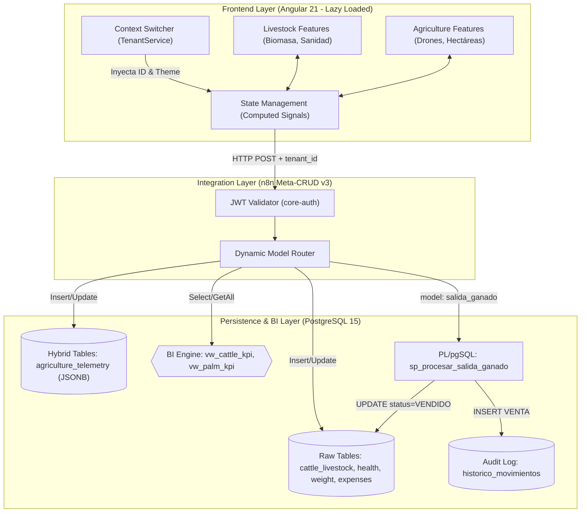

# 🏛️ Architecture Specification & Meta-CRUD Engine Blueprint

## 📝 Descripción

**Project:** Hosting3M Automation Suite (Agro ERP)
**Version:** v1.8.0 (Multi-Domain, Hybrid Telemetry & PL/pgSQL Engine)
**Stack:** Angular 21 (Signals) | n8n (API Gateway / MCP) | PostgreSQL (JSONB, Views & PL/pgSQL) | Tabler UI
**Author:** Francisco Jesus Pérez Pimienta

## 📝 1. Estructura del Workspace (Feature-Driven Architecture)

El frontend está desarrollado sobre un Monorepo en Angular 21 utilizando una arquitectura orientada a características (*Feature-Driven*), diseñada para un aislamiento estricto de dominios de negocio y carga perezosa (*Lazy Loading*)[cite: 1, 4].

```text
├── apps/
│   └── agro-erp/                       # Aplicación unificada Multi-Dominio[cite: 3, 4]
│       ├── src/
│       │   ├── app/
│       │   │   ├── core/               # Singletons globales (TenantService, Interceptors)[cite: 1, 4]
│       │   │   ├── features/           # Dominios Operativos Completamente Aislados[cite: 1, 4]
│       │   │   │   ├── agriculture/    # Módulo Palma (Telemetría, Drones, Hectáreas)[cite: 2, 4]
│       │   │   │   └── livestock/      # Módulo Ganadero (Biomasa, Sanidad, Pesajes)[cite: 3, 4]
│       │   │   ├── shared/             # Componentes UI reutilizables comunes
│       │   │   ├── app.config.ts       # Configuración global del Core de Angular
│       │   │   └── app.routes.ts       # Enrutamiento con Lazy Loading Dinámico[cite: 1, 4]
│       │   └── styles/
│       │       ├── themes/             # SCSS Reactivo (theme-cattle.scss / theme-palm.scss)[cite: 1, 4]
│       │       └── main.scss
│
├── libs/
│   └── core-auth/                      # Librería compartida de Autenticación y RBAC[cite: 1, 4]
│
├── workflows/                          # Orquestación de Backend y Agentes de IA en n8n[cite: 1]
│   └── 09-MCP-Agent-Cattle/            # Configuración de Servidores MCP y Captura de Campo[cite: 4]

```

---

## ⚙️ 2. Especificación Técnica del Motor Meta-CRUD (`crud_models`)

El sistema implementa el patrón **Meta-CRUD v3**, donde la lógica transaccional, validaciones y permisos no residen en controladores de código del backend, sino que son interpretados en tiempo de ejecución por el API Gateway de **n8n** a través del diccionario de metadatos de la tabla `crud_models`.

### 🔄 Diagrama de Flujo del Runtime Meta-CRUD



### 📋 Anatomía de Campos del Motor Dinámico

Basado en la telemetría actual registrada en la base de datos `hosting3m_db`, cada registro del Meta-CRUD se compone de:

1. **`model_name` & `table_name`:** Identificadores lógicos y físicos de la entidad en PostgreSQL.
2. **`allowed_fields`:** Arreglo estricto de columnas permitidas en mutaciones (Filtro de seguridad contra inyecciones de parámetros).
3. **`schema_json`:** Validador de tipos y campos obligatorios en el *Runtime*. Convierte tipos de datos de payloads débiles (strings de la IA/Frontend) a tipos fuertemente tipados en Postgres.


4. **`allowed_ops`:** Restringe las operaciones HTTP/CRUD permitidas para el modelo (ej. `SELECT, INSERT, UPDATE, DELETE, GETONE, GETALL`).
5. **`hooks`:** Micro-orquestaciones (`pre` y `post`) ejecutadas antes o después de la transacción (ej. disparar un webhook de alerta en mortalidad).
6. **`allowed_roles_*`:** Matriz de Control de Acceso Basado en Roles (RBAC) evaluada en caliente por el Interceptor de Seguridad.
7. **`joins`:** Definición declarativa de hidratación relacional. Permite inyectar datos de tablas padre sin que el cliente Frontend construya consultas complejas.

---

## 📊 3. Modelos Operativos Registrados (Módulo Ganadero)

A continuación se detalla el comportamiento del motor para los modelos vigentes extraídos del sistema:

### 🐾 Modelo: `cattle_livestock` (ID: 37)

* **Permisos de Operación:** `SELECT, INSERT, UPDATE, DELETE, GETONE, GETALL` (CRUD Full).


* **RBAC Operativo:**
* *Lectura:* `ADMIN, EDITOR, CUSTOMER`
* *Escritura (Insert/Update):* `ADMIN, EDITOR`
* *Borrado:* `ADMIN` (exclusivo)


* **Declarative Joins:** Hidrata automáticamente el campo `tenant_id` hacia la tabla `companys` para retornar el alias comercial bajo la propiedad `tenant_name`.


### 🩺 Modelo: `cattle_health_logs` (ID: 39)

* **Permisos de Operación:** `SELECT, INSERT, GETALL` (Inmutable, no permite modificaciones directas por auditoría).
* **Estructura JSONB:** El campo `medicines_json` encapsula de forma no relacional la dosificación e insumos utilizados.


* **Declarative Joins:** Amarra el `livestock_id` con `cattle_livestock` para retornar de forma nativa el identificador nacional `rfid_siniiga`.

### ⚖️ Modelo: `cattle_weight_logs` (ID: 38)

* **Permisos de Operación:** `SELECT, INSERT, GETALL`
* **RBAC Especializado:** Habilita el rol `IOT` en inserción. Esto permite que básculas automáticas o lectores RFID periféricos inyecten telemetría de biomasa de manera segura a la base de datos sin comprometer otros modelos.


* **Declarative Joins:** Tracciona las columnas `category` (renombrada a `animal_category`) y `rfid_siniiga` de la entidad maestro de ganado.

### 💰 Modelo: `cattle_expenses` (ID: 44)

* **Permisos de Operación:** CRUD Completo.
* **Hydration Multidireccional:** Ejecuta un doble join nativo:
1. Con `cattle_livestock` para inyectar contexto de negocio (`numero_fuego`, `business_model`).
2. Con `cattle_health_logs` para asociar costos financieros directamente a tratamientos médicos específicos (`health_event_type`, `health_event_date`).


### 🚪 Modelo: `salida_ganado` (ID: 46)

* **Naturaleza:** Modelo Meta-CRUD atípico — `table_name` apunta a una función PL/pgSQL (`sp_procesar_salida_ganado`) en lugar de una tabla física, y `primary_key` es `electronic_rfid`.
* **Permisos de Operación:** `INSERT` únicamente (invocación de la rutina, no persistencia directa).
* **RBAC Operativo:**
* *Invocación:* `ADMIN, EDITOR`
* *Update/Delete:* `ADMIN` (sin efecto práctico, el modelo no expone esas operaciones)


* **Efecto Colateral:** Cada invocación exitosa muta `cattle_livestock` (`current_status = VENDIDO`, `upp_origen = NULL`) e inserta un registro `VENTA` en `historico_movimientos`. Ver [`DATABASE_SCHEMA.md`](./DATABASE_SCHEMA.md#sp_procesar_salida_ganadop_electronic_rfid) para las reglas normativas de rechazo (TB/Brucelosis > 60 días).
* **Registrado:** 2026-07-02, como parte del Sprint 1 de trazabilidad de salida de ganado (300 cabezas / UPP La Bendición, UPP 54).

### 📂 Modelos Secundarios:

* **`cattle_tenants` (ID: 36):** Controla las organizaciones ganaderas, uniones o instancias gubernamentales. *Lectura:* `ADMIN, EDITOR`. *Escritura/Borrado:* `ADMIN` exclusivo.
* **`cattle_task_evidence` (ID: 40):** Permite el almacenamiento de URLs de auditoría física (fotografías/videos de campo) vinculándolas al ciclo operativo del animal. CRUD completo, lectura abierta a `CUSTOMER`.

```

