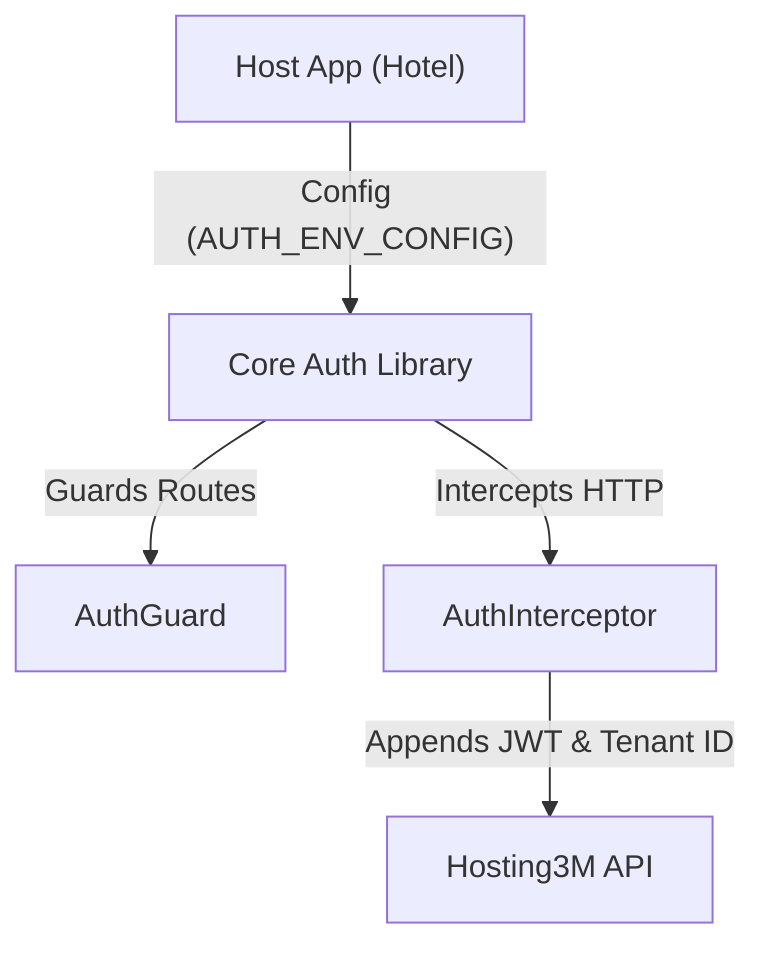

# 🏛️ Architecture Overview: Core Auth Library

## 📝 Descripción
**Project:** Core Auth (Shared Angular Library)  
**Type:** Angular Library (Standalone)  
**Version:** v0.0.1[cite: 26]  
**Stack:** Angular 21[cite: 26] | HTTP Interceptors | Route Guards  
**Consumer:** Dashboard Hotel

**Core Auth** es una librería transversal diseñada para unificar la autenticación y la resolución de contexto multi-empresa (Tenant). Su responsabilidad principal es interceptar peticiones, inyectar credenciales y bloquear rutas no autorizadas.

## 1. High-Level Design
La librería utiliza `InjectionTokens` para recibir las URLs de la API desde la aplicación host (`apiUrl_crud`, `apiUrl_token`)[cite: 29]. El `AuthInterceptor`[cite: 27] captura todas las peticiones salientes y les adjunta el JWT y el `id_company` activo.



### Principios de Diseño:

1. **Multi-Tenant First:** Toda sesión está amarrada a un `CompanyContext` (`id_company`, `company_name`, `role`).


2. **Environment Agnostic:** Definición estructurada mediante la interfaz `AuthEnvironmentConfig` garantizando que la librería nunca posea variables de entorno fijas.


## 2. Library Structure

```text
projects/core-auth/src/lib/
├── auth.config.ts        # Definición de Interfaces (CompanyContext, AuthEnvironmentConfig) y Tokens[cite: 29]
├── auth/
│   ├── auth.guard.ts     # Protección de rutas[cite: 27]
│   └── auth.interceptor.ts # Inyección de Headers HTTP[cite: 27]
├── services/
│   ├── auth.service.ts   # Manejo de JWT y Login[cite: 27]
│   └── tenant.service.ts # Lógica de multiempresa[cite: 27]
├── tenant-selector/
│   └── tenant-selector.component.ts # Componente visual de selección[cite: 27]
└── public-api.ts         # Punto de entrada (Barrel file)[cite: 27]

```

## 3. Data Flow

1. **Login:** El `AuthService` autentica al usuario usando la `apiUrl_token`.


2. **Tenant Resolution:** El `TenantService` carga el arreglo de empresas y asigna un `CompanyContext` activo.


3. **Execution:** El `AuthInterceptor` inyecta dinámicamente este contexto en cada petición HTTP hacia la base de datos central.


## 📦 Authors

**Francisco Jesus Pérez Pimienta**
*Senior Systems Architect & Project Lead*
Hosting3M Automation Suite

---

*Built with the assistance of AI-powered development tools.*
