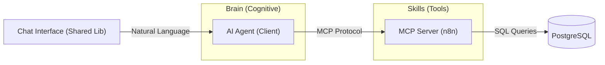

# 🏛️ Architecture Overview: AdminHotel Dashboard

## 📝 Descripción
**Project:** AdminHotel Dashboard (Hosting3M Automation Suite)
**Version:** v0.8.0 (Eco-Hotel Transformation)
**Stack:** Angular 21 (Signals) | n8n (API Gateway) | PostgreSQL (Persistence)
**Author:** Francisco Jesus Pérez Pimienta

**AdminHotel Dashboard** es una aplicación web de alto rendimiento construida sobre Angular 21, diseñada como la interfaz administrativa oficial de la suite de automatización Hosting3M.

## 1. High-Level Design (The "Big Picture")
El sistema sigue una arquitectura **Data-Access Service Pattern** altamente desacoplada. El frontend no contiene lógica SQL ni reglas de negocio complejas del lado del servidor; actúa como un cliente inteligente que consume un **Dynamic CRUD Engine**.

### Principios Clave:

1. **Smart Services / Dumb Components:** Los componentes (`.ts`) solo gestionan el estado de la vista (`viewMode`). La lógica de negocio y las llamadas a la API residen estrictamente en los servicios.
2. **Meta-Driven Backend:** La API no está "hardcodeada". n8n consulta la tabla `crud_models` para saber qué campos son requeridos y qué validaciones aplicar.
3. **Reactivity First:** Uso intensivo de Angular Signals para el manejo de estado.
4. **DRY & Modularity:** La funcionalidad transversal (como el Chat IA) se consume desde librerías compartidas.

---

## 2. Frontend Structure (Modular Architecture)

La aplicación sigue una estructura híbrida basada en Features y Librerías Compartidas.

### 📂 src/app/core (The Singleton Layer)

Contiene elementos transversales: `AuthInterceptor`, `AuthGuard` y modelos globales.

### 📂 src/app/features (Domain Logic)

Aquí vive el negocio específico del Hotel.

| Feature | Responsabilidad | Componentes Clave | Servicios |
| --- | --- | --- | --- |
| **Booking** | Ciclo de vida de la reserva. | `ReservationManager`, `CheckinForm`. | `BookingService`. |
| **Dashboard** | Vista operativa principal. | `RoomCard` (Estado visual). | `HotelService`. |
| **Maintenance** | Gestión de incidencias (Tickets). | `MaintenanceMonitor`, `TicketModal`. | `MaintenanceService`. |
| **Assets** | Inventario físico y garantías. | `AssetFormModal`, `AssetList`. | `AssetService`. |
| **Finance** | Finanzas CAPEX/OPEX. | `DailyReportModal`, `ExpenseForm`. | `ReportService`. |
| **Quality** | Control de Calidad (Rondines). | `RoomChecklistModal`. | `HotelService`. |

### 📂 External Libraries (Workspace)

* **@hosting3m/ui-chat:** Interfaz de usuario y lógica de conexión con el Agente IA (Standalone).

---

## 3. The Data Layer: Dynamic CRUD Engine

El backend es un motor transaccional basado en operaciones (`insert`, `update`, `delete`, `getall`) enviadas a `/crud/v3/:model`.

### La Tabla `crud_models` (The Brain)

Define la "Constitución" del sistema (validación de campos, tipos de datos y permisos RBAC) antes de que n8n ejecute cualquier query.

---

## 4. Database Schema & Relationships (Eco-Hotel Extensions)

Se han añadido entidades críticas para la gestión de activos y mantenimiento.

### Entidades Principales (`public` schema)

* **companys (Tenant):** Tabla raíz para multi-tenancy.
* **hotel_rooms:** Inventario físico (Status & Cleaning).
* **hotel_guests:** Identidad única (`doc_id`, `email`).
* **hotel_bookings:** Nexo transaccional.

### Entidades Eco-Hotel (NUEVO v0.8)

* **hotel_maintenance_tickets:** Trazabilidad de fallos.
* *Logica:* Vincula `room_id` y `priority`. Controla el ciclo de vida de la incidencia.

* **hotel_assets:** Inventario Fijo (Digital Twin).
* *Datos:* `serial_number`, `purchase_date`, `warranty_expiration`. Permite auditoría de activos por habitación.

* **hotel_expenses (Update):** Finanzas Estratégicas.
* *Nueva Columna:* `project_phase` (0=Planning, 1=Obra Negra, etc.) para separar CAPEX de OPEX.

---

## 5. Key Workflows & Patterns

### A. Pattern: Reservation Manager (Orchestrator)

Separación de responsabilidades entre Manager (Lógica) y Form (Presentación).

### B. Pattern: Ticket-Driven State Machine [NUEVO]

El estado de la habitación reacciona automáticamente a los tickets de mantenimiento:

1. **Report Ticket:** Si se crea un ticket "Crítico", la habitación pasa a status `MAINTENANCE`.
2. **Resolve Ticket:** Al cerrar el ticket, la habitación pasa automáticamente a `DIRTY` (requiere limpieza post-mantenimiento) antes de estar `AVAILABLE`.

### C. Pattern: Configuration Injection (DI)

Uso de `CHAT_CONFIG_TOKEN` para inyectar la configuración del entorno en la librería de chat compartida.

### D. Pattern: Hybrid Persistence (Smart Merge)

Uso de JSONB en `hotel_room_inspections` para checklists dinámicos que pueden evolucionar sin migraciones SQL.

---

## 6. Future Scalability

* **WhatsApp AI Agent:** Preparado para inserciones automáticas con rol `bot`.
* **Eco-Intelligence (IoT):** Futura integración de `utility_readings` para medidores de luz y agua.

---

*Document generated regarding the v0.8.0 codebase state.*
