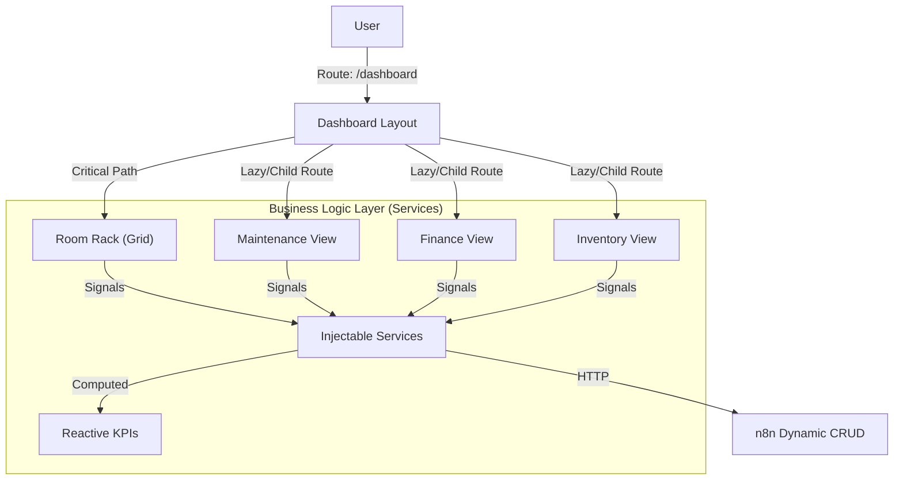

# 🏛️ Architecture Overview: AdminHotel Dashboard

## 📝 Descripción

**Project:** AdminHotel Dashboard (Hosting3M Automation Suite)
**Version:** v0.9.0 (Eco-Hotel Optimization & Performance)
**Stack:** Angular 21 (Signals & Router) | n8n (API Gateway) | PostgreSQL (Persistence)
**Author:** Francisco Jesus Pérez Pimienta

**AdminHotel Dashboard** es una aplicación web de alto rendimiento construida sobre Angular 21. En su versión **v0.9.0**, ha evolucionado de una interfaz basada en modales a una **Arquitectura Distribuida de Rutas Hijas**, optimizada para tiempos de carga interactivos (TTI) y usabilidad móvil.

## 1. High-Level Design (The "Big Picture")

El sistema mantiene el patrón **Data-Access Service**, pero ahora implementa una estrategia de **Carga Diferida (Deferred Loading)** y **Enrutamiento Jerárquico**.

### Principios Clave v0.9:

1. **Distributed Routing Strategy:** Desacoplamiento de módulos. Funcionalidades complejas (Finanzas, Mantenimiento) tienen sus propias URLs y ciclos de vida, liberando al componente padre.
2. **Smart Services / Presentational Components:** La lógica financiera y de inventario se movió estrictamente a `ReportService` y `AssetService`. Los componentes son meros consumidores de `Signals`.
3. **Perceived Performance First:** El hilo principal prioriza el `Room Rack`. Datos secundarios (Reservas, Usuarios) se cargan asíncronamente en segundo plano.
4. **Native Theming:** Uso de Variables CSS (`var(--tblr-body-bg)`) para un *Dark Mode* instantáneo sin recarga.

---

## 2. Frontend Structure (Distributed Architecture)

La aplicación ha migrado de "Componentes en Modals" a "Vistas Enrutadas".

### 📂 src/app/features (Routed Domains)

| Feature | Ruta (URL) | Responsabilidad | Servicios Core |
| --- | --- | --- | --- |
| **Room Rack** | `/dashboard` | Vista operativa principal (Grid). Carga prioritaria. | `HotelService`. |
| **Maintenance** | `/dashboard/mantenimiento` | Monitor de tickets a pantalla completa (Kanban/List). | `MaintenanceService`. |
| **Finance** | `/dashboard/finanzas` | Reportes financieros, balances y Corte de Caja. | `ReportService` (Logic Heavy). |
| **Inventory** | `/dashboard/inventario` | Gestión logística global y auditoría de activos. | `AssetService`. |
| **Administration** | `/dashboard/huespedes` | Gestión de CRM y Staff. | `GuestService`, `UserService`. |

### 📂 src/app/core (Performance Layer)

* **Skeletons:** Optimizados (4 nodos, 0.1s fade-in) y adaptables al tema oscuro para evitar *layout shifts*.

---

## 3. The Business Logic Layer (Reactive Services)

En la v0.9.0, los servicios dejaron de ser simples fetchers de datos para contener la **Inteligencia de Negocio**.

### 🧠 ReportService (The Financial Brain)

* **Responsabilidad:** Centraliza el cálculo de balances.
* **Mecanismo:** Utiliza `computed()` signals para recalcular dinámicamente:
* `totalIncome`, `totalExpenses`, `netBalance`.
* Filtrado por rangos de fecha (Día/Semana/Mes) sin re-consultar la API innecesariamente.

### 🧠 AssetService (The Logistics Brain)

* **Responsabilidad:** CRUD universal de activos.
* **Capacidad:** Maneja tanto el inventario global (Bodega) como la asignación local (Habitación) mediante la misma lógica.

---

## 4. Key Workflows & Patterns (v0.9 Updates)

### A. Pattern: Async Critical Path (Performance)

Para desbloquear el TTI (Time to Interactive) rápidamente:

1. **Hilo Principal:** Ejecuta `loadRooms()` inmediatamente.
2. **Hilo Secundario (Deferred):** Usa `setTimeout` para posponer la carga de `Reservations`, `Users` y `Guests`, permitiendo que la UI responda antes de tener todos los datos.

### B. Pattern: Polymorphic Components

El componente `AssetFormModal` ahora es consciente del contexto:

* **Contexto Global:** Permite crear activos en bodega.
* **Contexto Local:** Permite asignar/mover activos desde el detalle de una habitación específica.

### C. Pattern: Computed Signal Reactivity

La UI no recalcula totales. La UI se suscribe a una Señal Computada en el servicio.

* *Antes:* `calculateTotal()` en el HTML (malo para performance).
* *Ahora:* `readonly total = computed(() => ...)` en el Servicio.

### D. Pattern: CSS Variable Theming

Eliminación de estilos *hardcoded*. El tema visual se controla mediante variables CSS en el `:root`, permitiendo transiciones suaves entre Light/Dark mode y facilitando el mantenimiento futuro.

---

## 5. Database Schema & Relationships

Se mantiene la estructura de datos sólida de la v0.8, pero su consumo es más eficiente.

* **hotel_maintenance_tickets:** Ahora visualizados en un dashboard dedicado (`/mantenimiento`) en lugar de un modal flotante.
* **hotel_assets:** Gestionados via `AssetService` con capacidades de filtrado por estado (`GOOD`, `DAMAGED`, `MISSING`).

---

## 6. Future Scalability

* **PWA Offline Mode:** Gracias a la arquitectura de rutas y carga asíncrona, el siguiente paso lógico es implementar Service Workers para caché de rutas.
* **Lazy Loading Modules:** Las rutas hijas están preparadas para ser cargadas mediante `loadComponent` (Lazy Loading real) en futuras versiones para reducir el bundle inicial.

---

*Document updated regarding the v0.9.0 codebase state (Performance & Routing Refactor).*