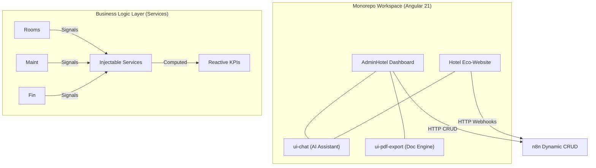

# 🏛️ Architecture Overview: AdminHotel & Eco-Website

## 📝 Descripción

**Project:** Hosting3M Automation Suite (AdminHotel Dashboard & Eco-Website)
**Version:** v1.1.0 (Monorepo, Eco-Hotel Optimization & Digital Export)
**Stack:** Angular 21 (Signals, Router, Monorepo) | n8n (API Gateway & Webhooks) | PostgreSQL (Persistence) | Tailwind CSS v3
**Author:** Francisco Jesus Pérez Pimienta

La suite ha evolucionado en su versión **v1.1.0** de una aplicación única a un **Monorepositorio (Monorepo)**. Ahora gestiona tanto la Intranet Administrativa (Dashboard distribuido) como la Landing Page pública (hotel-website), compartiendo librerías de IA y generación de documentos en un ecosistema unificado.

## 1. 🗺️ High-Level Design (The "Big Picture")

El sistema mantiene el patrón **Data-Access Service** para el Dashboard, pero expande su alcance integrando micro-frontends (librerías) y múltiples aplicaciones que consumen el mismo motor de **n8n**.



### Principios Clave v1.1.0:

1. **Monorepo Strategy:** Código centralizado. Las aplicaciones (`dashboard`, `hotel-website`) comparten dependencias y librerías (`ui-chat`, `ui-pdf-export`), garantizando consistencia visual y funcional.
2. **Agnostic Document Generation:** La lógica de creación de PDFs y cálculo de impuestos (IVA/ISH) se extrajo a una librería independiente, liberando a los componentes de la vista de cargas pesadas.
3. **Distributed Routing & Lazy Loading:** Se mantiene y mejora el desacoplamiento. El Dashboard carga por dominios (`/mantenimiento`, `/finanzas`), y el Website opera como una SPA optimizada para SEO y rendimiento.
4. **Native Theming & Glassmorphism:** Uso de Variables CSS para *Dark Mode* en el dashboard y directivas Tailwind avanzadas (*Glassmorphism*, paletas Biofílicas) para la interfaz pública.

---

## 2. 📂 Workspace Structure (Distributed Architecture)

La aplicación ha migrado a un espacio de trabajo estructurado por proyectos.

### Aplicaciones Principales

| Proyecto | Ruta / Dominio | Responsabilidad |
| --- | --- | --- |
| **dashboard** | `/dashboard/*` | Intranet operativa. Gestión de Room Rack, Finanzas, Mantenimiento e Inventario. |
| **hotel-website** | `/` (Pública) | Landing page de alta conversión, captura de leads y presentación *Eco-Boutique*. |

### Librerías Compartidas (Shared Libs)

| Librería | Responsabilidad | Servicios Core |
| --- | --- | --- |
| **ui-chat** | Widget de conserje virtual mediante IA conectado por MCP a n8n. | `AiService`, `CHAT_CONFIG_TOKEN`. |
| **ui-pdf-export** | Motor de generación de reportes y cotizaciones (jsPDF + AutoTable). | `PdfExportService`. |

---

## 3. 🧠 The Business Logic Layer (Reactive Services)

Se han añadido nuevos "Cerebros" para manejar las capacidades de la v1.1.0.

### 🧠 PdfExportService (The Document Brain)

* **Responsabilidad:** Generación de documentos 100% en el cliente (Client-side).
* **Mecanismo:** Recibe una interfaz abstracta (`PdfExportConfig`) y maneja internamente la agrupación de partidas, renderizado de tablas y cálculo de impuestos (16% IVA, 2% ISH) sin bloquear el hilo principal de Angular.

### 🧠 ReportService (The Financial Brain) - *Updated*

* **Responsabilidad:** Centraliza el cálculo de balances y separa conceptos contables.
* **Mecanismo:** Diferencia los flujos de caja en **OPEX** (Gasto Operativo) y **CAPEX** (Inversión de Obra/Remodelación), utilizando `computed()` signals para recalcular `netBalance` al instante.

---

## 4. ⚙️ Key Workflows & Patterns (v1.1.0 Updates)

### A. Pattern: Batch Booking (Prevención de Race Conditions)

El sistema ahora soporta la reserva múltiple para clientes corporativos. Implementa el método `isRoomFree` antes de cada inserción transaccional en n8n, asegurando que no existan sobreventas o cruces de disponibilidad en el rack.

### B. Pattern: Client-Side Document Rendering

En lugar de generar PDFs en el backend (lo cual consume recursos de servidor), la librería `ui-pdf-export` toma los datos crudos en formato JSON y los procesa vectorialmente en el navegador del usuario, mejorando la velocidad de descarga a milisegundos.

### C. Pattern: Tokenized Configuration (Dependency Injection)

La librería `ui-chat` utiliza `InjectionTokens` (`CHAT_CONFIG_TOKEN`) para recibir su configuración. Esto permite que el mismo componente se vea verde y se llame "Asistente San José" en la web pública, pero pueda reutilizarse con otros colores en futuras aplicaciones del Monorepo.

---

## 5. 🗄️ Database Schema & Relationships

Se prepara el terreno para la Fase II del Eco-Hotel.

* **hotel_guests:** Integración en proceso para soportar perfiles enriquecidos mediante etiquetas (tags como *Senior, Nómada*) y seguimiento de fidelidad.
* **hotel_metrics (Planeado):** Estructura diseñada para almacenar las lecturas de consumos de CFE y agua, habilitando el dashboard de sustentabilidad (Eco-Metrics).

---

## 6. 🚀 Future Scalability

* **CRM y Eco-Metrics:** Activación de los flujos de trabajo para perfilar huéspedes y monitorear la huella de carbono/hídrica.
* **PWA Offline Mode:** Implementar Service Workers para asegurar que el rack de habitaciones opere en la recepción incluso ante caídas de red temporales.

## 📦 Authors

**Francisco Jesus Pérez Pimienta**
*Senior Systems Architect & Project Lead*
Hosting3M Automation Suite

```
---
*Built with the assistance of AI-powered development tools.*

```