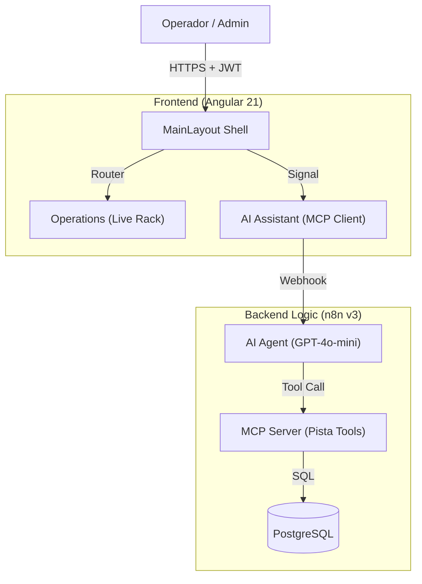

# ⛸️ Architecture Overview: PistaHielo Operations Center

## 📝 Descripción
**Project:** PistaHielo Dashboard (Módulo de la Suite Hosting3M)
**Version:** v0.7.0 (Stable Production)
**Stack:** Angular 21 (Signals, Computed) | n8n v2.6.4 (Orquestador) | PostgreSQL (pgvector)
**Patrón Arquitectónico:** Layout Shell Pattern + Reactive Signal Engine.
**Author:** Francisco Jesus Pérez Pimienta

**Pista de Hielo** es una aplicación web progresiva (PWA) de alto rendimiento, diseñada como la interfaz administrativa oficial de la suite de automatización Hosting3M. Integra operaciones de tiempo real con control financiero estricto.

## 1. Diseño de Alto Nivel: Flujo de Navegación y Datos
La arquitectura implementa un **"Main Layout Shell"** que mantiene el contexto mientras el Agente de IA asiste en tareas de consulta y escritura.




### Principios Clave:

1. **Layout Shell Architecture:** Un componente padre (MainLayout) gestiona la estructura visual, la responsividad móvil (hamburguesa) y la sesión, desacoplando la navegación de la lógica de negocio.
2. **Reactive Pricing Engine:** Uso de computed() signals para recalcular costos en tiempo real, integrando la Regla Zamboni (-15 min) solicitada vía UI o IA.
3. **Global Icon Strategy:** Para evitar errores de ejecución y reducir el boilerplate, los iconos (Lucide) se inyectan globalmente en `app.config.ts`, asegurando disponibilidad en todos los componentes dinámicos.
4. **MCP (Model Context Protocol):** El backend expone herramientas de base de datos (Ver Pista Activa, Reporte Ventas) que el Agente de IA utiliza para responder con datos reales.

---

## 2. Frontend Structure (Modular Architecture)

La aplicación se ha reestructurado en dominios funcionales claros:

📂 src/app/core (The Singleton Layer)
Contiene elementos que se instancian una sola vez y son transversales a toda la app.
* **Config:** `app.config.ts` (Global Providers, Icon Registry).
* **Auth:** auth.interceptor (inyecta JWT), auth.guard (protección de rutas).
* **Services:** AuthService (manejo de sesión), LayoutService (Estado del Sidebar).

📂 src/app/features/pista
Aquí vive el negocio. Cada carpeta es un módulo autocontenido.

| Módulo | Componente | Responsabilidad | Componente Clave |
| --- | --- | --- | --- |
| Operations | IceMonitor | Visualización en tiempo real (Signals). Polling inteligente (30s). |  |
|  | EntryForm | Interfaz "Touch-First" para registro rápido de patines. |  |
|  | CheckoutModal | **Cálculo de "Medianoche"** (soporte para turnos que cruzan de día) y regla Zamboni. |  |
| ShiftReport | Dashboard financiero. Filtros de fecha ISO compatibles con n8n. |  |  |
|  | ClientList | Directorio de alumnos y gestión de membresías. |  |

📂 src/app/shared (Reusability)
* **Sidebar:** Componente inteligente con estado colapsable (Mini-Sidebar) y gestión de temas (Dark/Light).

---

## 3. Capa de Negocio: Workflows de n8n Especializados

La lógica pesada reside en el backend, permitiendo cambios en reglas de negocio sin redesplegar el frontend.

** Workflow: v3/ai/chat-pista**
    * Rol: Asistente Operativo especializado en la pista.
    * Capacidades: Gestión de entrada/salida, verificación de integridad de datos (MÉTACRUD) y auditoría de tiempos excedidos.

** Workflow: v3/MCP Server Pista**
    * Tool: Ver Pista Activa: Ejecuta un JOIN con ph_clients para obtener nombres reales y calcula minutos transcurridos desde created_at.
    * Tool: Reporte Ventas Hoy: Sumariza ingresos por método de pago (CASH/CARD) del día en curso.
    * Tool: Verificar Patin: Consulta el estado de ocupación de un número de patín específico en metadata.

---

## 4. Modelo de Datos (PostgreSQL Schema)

Aprovechando la migración que realizamos hoy, la base de datos es el ancla de la soberanía de datos:

**Entidades Principales (** *public* **schema)**
* **ph_clients:** Directorio de identidades con soporte para membresías VIP.
* **ph_transactions:** Log central. El campo metadata (JSONB) almacena skate_number, rental_type y duration.
* **ph_inventory:** Control dual de consumibles y activos.

---

## 5. 📈 Roadmap de Implementación

```
Fase 1: Core Operativo (Completado)
    * Despliegue de los componentes de Angular: IceLiveMonitor y EntryForm.
    * Activación de los Workflows de n8n para Check-in/Check-out.

Fase 2: Estabilización y Finanzas (Completado - v0.6.0)
    * Solución de bugs críticos de tiempo (Midnight Crossing).
    * Reportes financieros precisos con filtros de fecha corregidos en backend.
    * UX Refinada: Sidebar colapsable y Dark Mode nativo.

Fase 3: IA & Analytics (Futuro)
    * Dashboard de analítica sobre rentabilidad por hora.
    * Agente de IA para consultas de disponibilidad vía WhatsApp.

Document generated regarding the v0.7.0 codebase state.