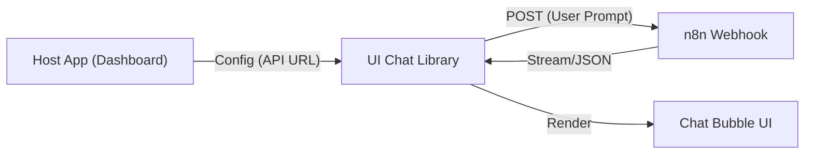

# 🏛️ Architecture Overview: UI Chat Library

## 📝 Descripción
**Project:** UI Chat (Shared Angular Library)  
**Type:** Angular Library (Standalone)  
**Version:** v0.3.0  
**Stack:** Angular 21 (Signals) | Markdown Rendering | HTTP Client  
**Consumer:** Dashboard Hotel, Pista de Hielo WebApp

**UI Chat** es un micro-frontend encapsulado como librería, diseñado para proporcionar una interfaz de conversación ("Chat Widget") agnóstica. Su única responsabilidad es renderizar mensajes y gestionar la comunicación HTTP con el Agente de IA en n8n.

## 1. High-Level Design
La librería sigue el patrón **Smart Service / Dumb Component**. El componente visual no sabe *qué* es la IA, solo sabe mostrar mensajes. El servicio gestiona la sesión y el transporte de datos.



### Principios de Diseño:

1. **Zero-Config Logic:** La librería maneja internamente el `sessionId` (generación y persistencia en localStorage/SessionStorage) para mantener el contexto de la conversación.
2. **Configurable Injection:** La URL del webhook y los estilos base se inyectan desde la aplicación padre mediante `InjectionToken`, permitiendo que el mismo chat apunte a diferentes agentes (Hotel vs Pista) sin cambiar el código.
3. **Reactive State:** Uso de **Signals** para el manejo de la lista de mensajes, asegurando un renderizado eficiente sin Zone.js overhead.

---

## 2. Library Structure

```text
projects/ui-chat/src/lib/
├── components/
│   └── ai-chat/          # El Widget visual (Burbujas, Input, Scroll)
├── services/
│   └── chat.service.ts   # Cliente HTTP y Gestión de Estado (Signals)
├── interfaces/
│   ├── message.type.ts   # { role: 'user'|'assistant', text: string }
│   └── config.token.ts   # Definición de InjectionTokens
└── ui-chat.component.ts  # Punto de entrada (Barrel file)

```

### Componentes Clave

* **AiChatComponent:**
* **Inputs:** `isOpen` (Visibilidad), `title` (Encabezado).
* **Features:** Auto-scroll al recibir mensajes, detección de "Enter" para enviar, estado de "Escribiendo...".
* **Rendering:** Soporte básico para Markdown (negritas, listas) en las respuestas del bot.


* **ChatService:**
* **Http Client:** Envía POST a la URL configurada.
* **Session Handler:** Genera un UUID v4 al iniciar y lo envía en cada request headers para que n8n mantenga la memoria (`Memory Buffer Window`).


---

## 3. Data Flow

1. **User Input:** El usuario escribe y presiona Enviar.
2. **Optimistic Update:** La UI muestra inmediatamente el mensaje del usuario y un loader ("...").
3. **Transport:** `ChatService` envía el payload `{ text: "...", sessionId: "xyz" }`.
4. **Response:**
* *Éxito:* Se reemplaza el loader con la respuesta de texto del agente.
* *Error:* Se muestra un toast de error y se permite reintentar.

## 📦 Authors

**Francisco Jesus Pérez Pimienta**
*Senior Systems Architect & Project Lead*
Hosting3M Automation Suite

```
---
*Built with the assistance of AI-powered development tools.*

```