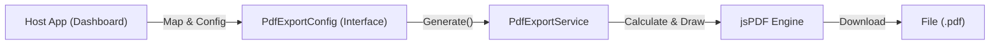

# 🏛️ Architecture Overview: UI PDF Export Library

## 📝 Descripción

**Project:** UI PDF Export (Shared Angular Library)
**Type:** Angular Library (Service-based)
**Version:** v1.0.0
**Stack:** Angular 21 | jsPDF | jsPDF-AutoTable
**Consumer:** Dashboard Hotel, Pista de Hielo WebApp (Future)

**UI PDF Export** es un motor de generación de documentos del lado del cliente. Su responsabilidad es encapsular la complejidad de dibujar coordenadas en PDF, calcular impuestos financieros y generar tablas dinámicas, exponiendo una API simple y estrictamente tipada para el consumo de las aplicaciones host.

## 1. High-Level Design

La librería sigue el patrón **Adapter / Utility Service**. Actúa como una "caja negra" de renderizado: recibe datos estructurados (JSON) y devuelve un archivo binario (PDF). No conoce la lógica de negocio del hotel, solo entiende de "Conceptos", "Cantidades" y "Precios".



### Principios de Diseño:

1. **Domain Agnostic:** La librería no sabe qué es una "Reserva" o una "Habitación". Solo procesa `PdfExportItem`. Esto permite reutilizarla para inventarios, reportes de gastos o tickets de venta sin cambios.
2. **Internal Math Engine:** Para evitar errores de redondeo en la UI, la librería recibe los montos brutos y se encarga internamente de desglosar y calcular:
* **Base Imponible**
* **IVA (16%)**
* **ISH (2%)**
* **Totales**


3. **Strict Contracts:** Uso de Interfaces TypeScript (`PdfExportConfig`) para obligar a la aplicación consumidora a proveer todos los datos necesarios (Emisor, Cliente, Ítems) antes de intentar generar el documento.

---

## 2. Library Structure

A diferencia de `ui-chat`, esta librería no tiene componentes visuales (HTML/CSS), es puramente lógica y servicios.

```text
projects/ui-pdf-export/src/lib/
├── interfaces/
│   └── pdf-export.interface.ts   # El Contrato (Configuración, Items, Estructura)
├── services/
│   └── pdf-export.service.ts     # El Motor (Singleton Service)
└── index.ts                      # Punto de entrada (Public API)

```

### Componentes Clave

* **PdfExportService:**
* **Role:** Singleton (`providedIn: 'root'`).
* **Responsibilities:**
* Inicialización del documento PDF y configuración de fuentes.
* Cálculo de coordenadas dinámicas (`startY`, `finalY`) para evitar superposiciones.
* Renderizado de tablas usando `jspdf-autotable` con estilos corporativos (Striped theme).
* Alineación precisa de columnas financieras (texto a la derecha).


* **PdfExportConfig (Interface):**
* Define la estructura obligatoria: `companyName`, `clientName`, `items[]`.
* Define configuraciones opcionales: `footerText` (datos bancarios), `currencySymbol`.


---

## 3. Data Flow

El flujo de datos es unidireccional y sincrónico:

1. **Selection (Host):** El usuario selecciona N elementos en la aplicación (ej. 3 Reservas).
2. **Mapping (Host):** El componente del Host transforma sus datos de dominio (`Reservation`) a datos de reporte (`PdfExportItem`).
* *Ejemplo:* `Reservation { room_id: 1, price: 500 }` -> `Item { concept: "Habitación Doble", total: 3500 }`.


3. **Configuration (Host):** Se instancia el objeto `PdfExportConfig` agregando metadatos (Logo, Dirección, Cliente).
4. **Processing (Library):**
* Se calcula la altura del encabezado.
* Se dibuja la tabla de ítems.
* Se calcula la posición vertical final (`lastAutoTable.finalY`).
* Se dibujan los totales y pies de página.


5. **Output (Browser):** Se dispara la descarga del archivo con el nombre sanitizado (ej. `Cotizacion_Cliente_X.pdf`).

## 📦 Authors

**Francisco Jesus Pérez Pimienta**
*Senior Systems Architect & Project Lead*
Hosting3M Automation Suite

```
---
*Built with the assistance of AI-powered development tools.*

```