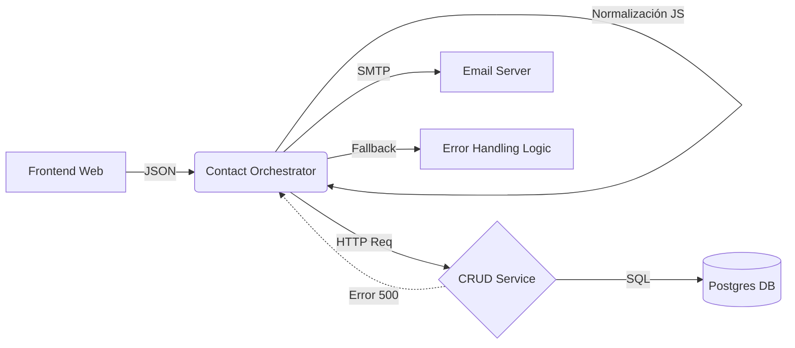

# 💡 Enterprise Contact Lead & CRM Sync (Hosting3m)

**Concepto:** Microservices Integration / Modular Design

Este flujo implementa un sistema robusto de captura de prospectos y sincronización con CRM utilizando **n8n**. El flujo está diseñado bajo una arquitectura de microservicios, integrando validación de identidad vía **JWT**, lógica de persistencia tipo "Upsert" (Update o Insert) y un sistema de notificaciones omnicanal (Email).

## 📝 Descripción

El workflow actúa como el backend inteligente para formularios de contacto de nivel empresarial. Su objetivo principal es garantizar que cada interacción del usuario se registre correctamente en la base de datos de clientes, evitando duplicados y asegurando la integridad de la información.

### Lógica del Sistema:
1.  **Seguridad (JWT):** Solo peticiones autenticadas pueden disparar el proceso.
2.  **Sanitización:** Dos capas de procesamiento en **JavaScript** limpian y normalizan los campos (nombres, teléfonos, correos).
3.  **Gestión de Datos (CRUD):** * Intenta insertar el nuevo prospecto.
    * Si el usuario ya existe (detección por email), el flujo recupera el ID existente y actualiza la información.
4.  **Confirmación Dual:** Envía un correo automático de agradecimiento al cliente y una notificación técnica detallada al equipo de ventas/soporte.

---

## 🛠️ Instalación

Para desplegar este workflow en tu infraestructura, sigue estos pasos:

1.  **Requisitos de Infraestructura:**
    * Instancia de **n8n v2.0.3** o superior.
    * Microservicio de autenticación JWT activo.
    * Servidor SMTP configurado para el envío de correos.

2.  **Importación del Workflow:**
    * Copia el contenido del archivo `.json` de este repositorio.
    * En n8n, selecciona "Import from File" o pega el JSON directamente en el lienzo.

3.  **Configuración de Credenciales:**
    * **JWT Auth:** Configura tu secreto de validación en el nodo Webhook.
    * **SMTP:** Vincula tus cuentas de correo (`contacto@hosting3m.com` y `n8n@hosting3m.com`).

4.  **Despliegue de Servicios Relacionados:**
    ```bash
    # Asegúrate de tener el microservicio de persistencia activo
    docker-compose up -d n8n-compose-scraper-service jwt-service
    ```

---

## 🚀 Uso

El flujo se activa mediante una petición `POST` al endpoint del Webhook. Es obligatorio incluir el encabezado de autorización.

### 🔄 Flujo de Datos (SOA Pattern)

1.  **Ingesta:** Webhook recibe datos del Frontend.
2.  **Normalización:** Nodo `Code` limpia y estandariza nombres y teléfonos (Javascript).
3.  **Persistencia Delegada:**
    * Llama al servicio interno `POST /crud/customers` para insertar.
    * Si el cliente existe, llama a `PUT /crud/customers` (Lógica Upsert manual).
4.  **Notificación Transaccional:** Envío de correos asíncronos vía SMTP (Confirmación al cliente + Alerta al admin).

### Ejemplo de Petición (cURL):

```bash
curl -X POST [https://tu-instancia-n8n.com/webhook/contactoHosting3m](https://tu-instancia-n8n.com/webhook/contactoHosting3m) \
-H "Authorization: Bearer <TU_TOKEN_JWT>" \
-H "Content-Type: application/json" \
-d '{
  "names": "Francisco",
  "middlename": "Jesus",
  "lastname": "Perez",
  "email": "cliente@ejemplo.com",
  "phone": "+529990000000",
  "service": "Hosting Web",
  "message": "Solicito información sobre planes NVMe."
}'
```

### Respuesta Exitosa:
JSON
`
{
  "success": true,
  "mensaje": "El mensaje se ha enviado de forma satisfactoria."
}
`

### 📡 Interacción entre Servicios



---

### 📦 Tecnologías
Este flujo de trabajo demuestra un dominio avanzado de la integración de sistemas modernos:
    * **n8n Orquestador:** Motor de flujos de trabajo basado en nodos.
    * **JavaScript (Node.js):** Lógica personalizada para manipulación de objetos JSON y limpieza de datos.
    * **REST API:** Comunicación con servicios externos de CRM y gestión de clientes.
    * **JWT (JSON Web Tokens):** Estándar de seguridad para la autenticación de la petición entrante.
    * **SMTP:** Protocolo de transferencia de correo para notificaciones automáticas.
    * **Docker:** Entorno de ejecución para asegurar la portabilidad de los servicios.

---

## 🤝 Contribución
###Si deseas mejorar este flujo o añadir validaciones adicionales (como MFA o logging avanzado):
    1. Haz un Fork del repositorio.
    2. Crea una nueva rama (git checkout -b feature/MejoraSeguridad).
    3. Realiza tus cambios y haz un Commit (git commit -m 'Añadida validación de expiración').
    4. Sube los cambios a tu rama (git push origin feature/MejoraSeguridad).
    5. Abre un Pull Request.

---

## 📄 Licencia
###Este proyecto demuestra la capacidad de integración de n8n con stacks modernos de backend:Este proyecto está bajo la licencia n8n Sustainable Use License. Eres libre de usarlo y modificarlo para fines personales o internos de empresa.


Desarrollado por: Francisco Jesus Pérez Pimienta - Ingeniero en Sistemas Computaciones y Maestro en Administracion de Proyectos.