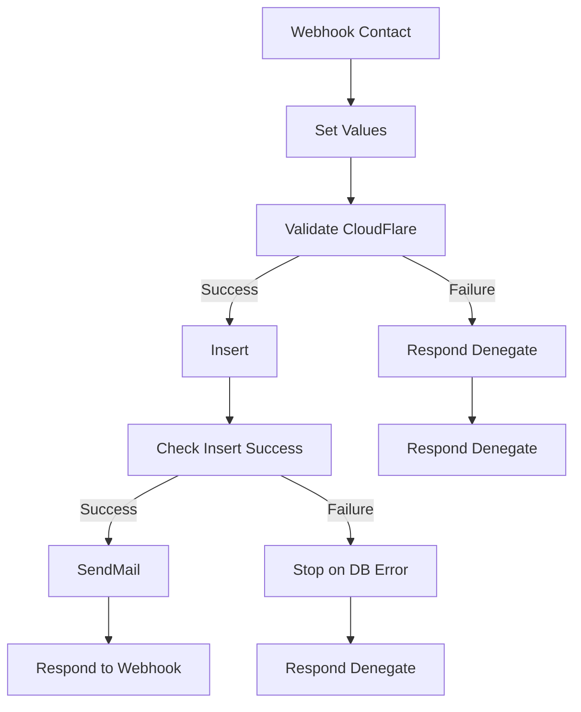

# v4/Contact Workflow

## Diagrama de Flujo


## Dependencias
- **Credenciales:**
  - SMTP para enviar correos electrónicos.
- **Nodos Externos:**
  - Webhook para recibir datos.
  - HTTP Request para interactuar con servicios externos.

## Diccionario de Datos
El Webhook principal espera recibir el siguiente JSON:

```json
{
  "names": "Nombre",
  "middlename": "Segundo Nombre",
  "lastname": "Apellido",
  "email": "correo@ejemplo.com",
  "phone": "1234567890",
  "service": "Servicio solicitado",
  "message": "Mensaje del contacto"
}