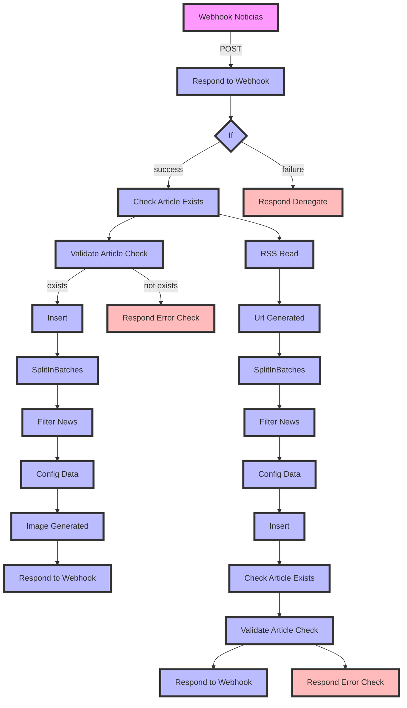

# v4/news Workflow Documentation

## Diagrama de Flujo



## Dependencias
- **Credenciales:**
  - `Authorization`: Token para acceder a los recursos.
  - `x-jwt-claim-role`: Rol del usuario para autorización.

- **Nodos Externos:**
  - Webhook para recibir datos.
  - HTTP Request para insertar artículos en la base de datos.

## Diccionario de Datos
El Webhook principal espera recibir un JSON con la siguiente estructura:

```json
{
  "url": "string",
  "title": "string",
  "source": "string",
  "image": "string",
  "published_at": "string"
}
```

- **url:** URL del artículo.
- **title:** Título del artículo.
- **source:** Fuente del artículo.
- **image:** URL de la imagen asociada al artículo.
- **published_at:** Fecha de publicación del artículo en formato ISO 8601.
