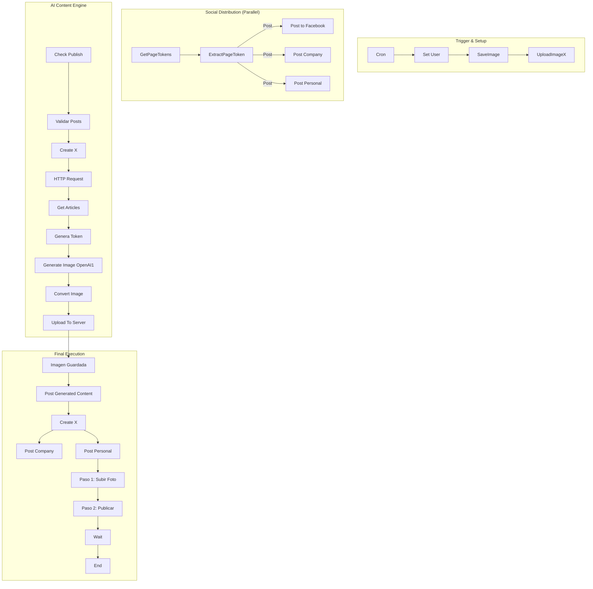

# README for v4/OmniChannel Workflow

## Diagrama de Flujo

## Dependencias
- **Credenciales:**
  - X API 1 (Twitter)
  - Facebook Graph Posts
  - LinkedIn Credential
  - OpenAi account

- **Nodos Externos:**
  - Facebook Graph API
  - OpenAI API

## Diccionario de Datos
### Cron
- **Schedule:** 7:05 AM

### Notas
- Asegúrate de que las credenciales estén configuradas correctamente en n8n.
- Revisa el diagrama de flujo para entender la lógica del workflow.