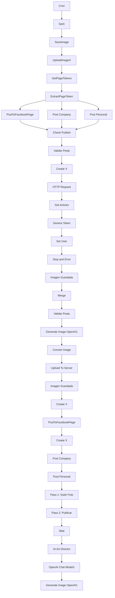

# README for v4/OmniChannel Workflow

## Diagrama de Flujo


## Dependencias
- **Credenciales:**
  - X API 1 (Twitter)
  - Facebook Graph Posts
  - LinkedIn Credential
  - OpenAi account

- **Nodos Externos:**
  - Twitter API
  - Facebook Graph API
  - OpenAI API

## Diccionario de Datos
### Webhook Principal
- **Estructura JSON Esperada:**
```json
{
  "operation": "getAll",
  "fields": {
    "created_at": {
      "_gte": "2023-01-01T00:00:00Z",
      "_lte": "2023-12-31T23:59:59Z"
    }
  }
}
```

### Notas
- Asegúrate de que las credenciales estén configuradas correctamente en n8n.
- Revisa el diagrama de flujo para entender la lógica del workflow.