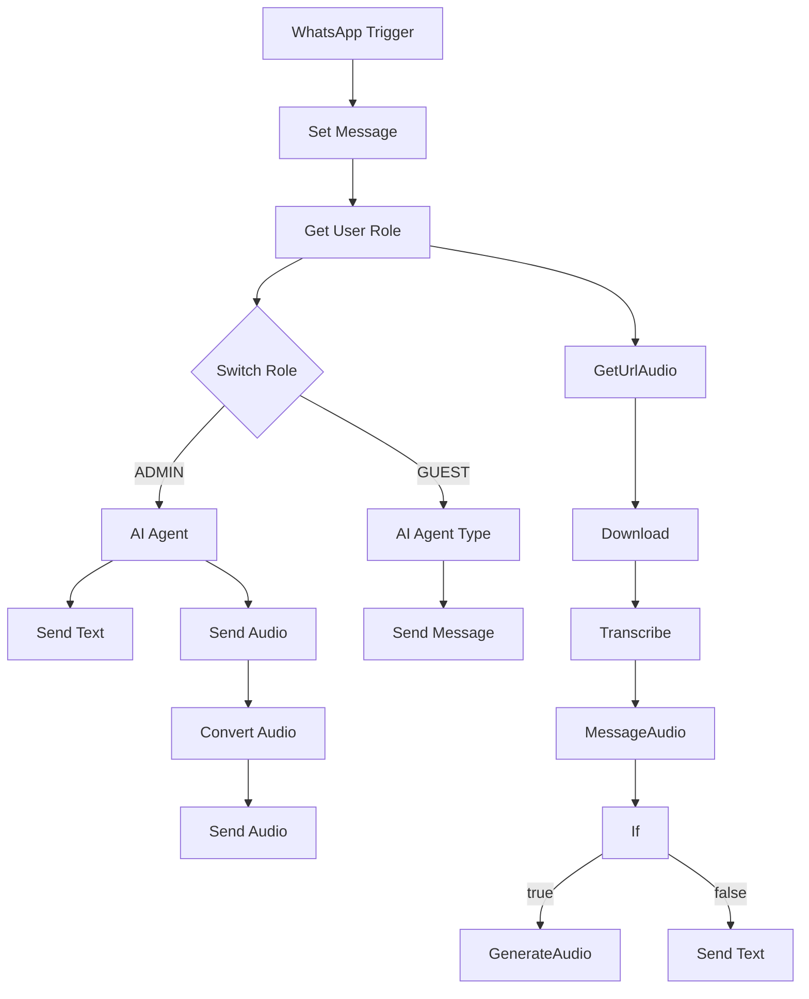

# WhatsApp Agent Workflow

## Diagrama de Flujo



## Dependencias
- **OpenAI API**: Se requiere una cuenta de OpenAI para el modelo de chat.
- **WhatsApp API**: Se necesita una cuenta de WhatsApp para enviar y recibir mensajes.
- **Postgres**: Se utiliza para obtener el rol del usuario basado en su número de teléfono.

## Diccionario de Datos
El Webhook principal espera recibir el siguiente JSON:

```json
{
  "messages": [
    {
      "from": "string",
      "text": {
        "body": "string"
      },
      "audio": {
        "id": "string"
      }
    }
  ],
  "role": "string"
}
```

---

Este README proporciona una visión general del flujo de trabajo del agente de WhatsApp, incluyendo un diagrama de flujo, las dependencias necesarias y el formato de datos esperado.