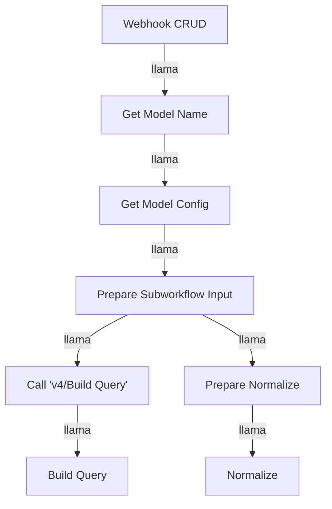

# Dynamic CRUD Engine

## 🧜‍♂️ Diagrama de Flujo


## 🔌 Dependencias
- **Credenciales:**
  - Postgres account
  - OpenAi account
- **Nodos Externos:**
  - Webhook
  - Execute Workflow

## 📖 Diccionario de Datos
El Webhook principal espera un JSON con la siguiente estructura:
```json
{
  "operation": "insert|update|delete|getone|getall",
  "body": {
    "fields": { /* Campos a insertar o actualizar */ },
    "filters": { /* Filtros para obtener registros */ }
  },
  "model_config": {
    "table_name": "nombre_tabla",
    "joins": [
      {
        "table": "nombre_tabla_destino",
        "own_col": "mi_columna_fk",
        "foreign_col": "columna_destino_pk"
      }
    ]
  }
}
```

## 🚀 Ejemplo de Uso
Ejecutar el siguiente cURL para llamar al Webhook:
```bash
curl -X POST https://hosting3m.com/crud/v4/model
-H "Content-Type: application/json"
-d '{
  "operation": "insert",
  "body": {
    "fields": {"nombre": "valor"}
  },
  "model_config": {
    "table_name": "mi_tabla"
  }
}'