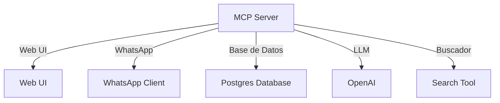

# MCP Server Hotel Architecture

## 🧜‍♂️ Diagrama de Arquitectura


## 🧠 Protocolo MCP
El servidor expone las siguientes herramientas:
- **Query Available**: Consulta habitaciones disponibles.
- **Query Rooms**: Agrupa habitaciones por tipo y precio.
- **Query Reservation By Name**: Busca reservas por nombre de huésped.
- **Query Available By Room**: Verifica disponibilidad de una habitación específica.
- **Get Inspection Issues**: Obtiene reportes de inspección de habitaciones.

## 🔌 Mapa de Dependencias
- **LLM Utilizado**: OpenAI (gpt-4o-mini)
- **Base de Datos**: Postgres

## 📖 Interface de API
El cliente debe enviar el siguiente JSON para activar el servidor:
```json
{ "messages": [...], "action": "chat" }
```

## 🚀 Instalación
Para configurar el Webhook del Servidor:
1. Asegúrate de que el servidor esté corriendo.
2. Configura el Webhook en el cliente para apuntar a `https://n8n.hosting3m.com/mcp/v3/hotel-management`.