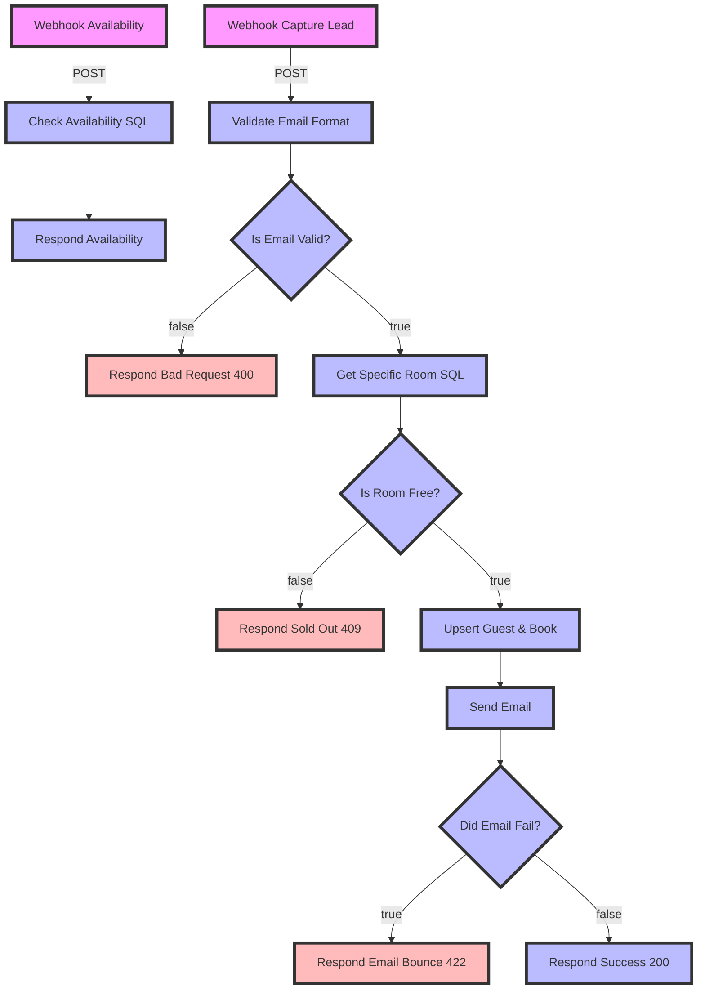

# v4/Public Booking Engine (B2C) Workflow Documentation

## 📝 Descripción
Este workflow actúa como el **Backend For Frontend (BFF)**, aislando de forma segura la base de datos de la web pública B2C. Gestiona la disponibilidad de inventario en tiempo real y el ciclo completo de captura de *leads* (pre-reservas) mediante una arquitectura tolerante a fallos, implementando la regla de negocio de *Soft Block* y *Quality Gates* para validación de correos.

## 🧜‍♂️ Diagrama de Flujo



## 🔌 Dependencias

* **Credenciales:**
* `Postgres account`: Permite las consultas de lectura para disponibilidad y la ejecución de transacciones complejas (CTE/Upserts) blindadas contra inyección SQL.
* `SMTP Account`: Autenticación para el envío asíncrono de instrucciones bancarias y confirmaciones a los huéspedes (`reservas@hosting3m.com`).


* **Nodos Externos:**
* `Webhook`: Exposición de endpoints públicos (`/public/availability` y `/public/lead`) sin JWT.
* `Postgres`: Consultas preparadas con `queryReplacement` y CTEs (`INSERT ... ON CONFLICT`).
* `EmailSend`: Orquestador de notificaciones con tolerancia a fallos activada (`continueRegularOutput`).
* `Code`: Motor Regex para *Quality Gate* sintáctico de correos.


## 📖 Diccionario de Datos

### 1. Endpoint: Check de Disponibilidad

Consulta el inventario agrupado por tipo de habitación sin exponer IDs internos ni datos confidenciales.

* **Método y Ruta:** `POST /webhook/public/availability`
* **Request Body:**

```json
{
  "checkin": "YYYY-MM-DD",
  "checkout": "YYYY-MM-DD"
}

```

* **Response (200 OK):**

```json
{
  "status": "success",
  "data": [
    {
      "type": "Kingsize",
      "available_count": "3",
      "price": "550.00"
    },
    {
      "type": "sencilla",
      "available_count": "6",
      "price": "500.00"
    }
  ]
}

```

### 2. Endpoint: Captura de Lead (Pre-Reserva)

Procesa la intención de reserva, valida el correo electrónico, asegura la disponibilidad final, inserta/actualiza al huésped, crea la reserva en estado `pending` y envía instrucciones de pago.

* **Método y Ruta:** `POST /webhook/public/lead`
* **Request Body:**

```json
{
  "name": "Francisco Jesus Perez Pimienta",
  "phone": "9930000000",
  "email": "ejemplo@correo.com",
  "checkin": "YYYY-MM-DD",
  "checkout": "YYYY-MM-DD",
  "room_type": "Kingsize",
  "guests": "2"
}

```

* **Responses:**
* **✅ 200 OK (Success):** El lead fue guardado y el correo de instrucciones enviado correctamente.
```json
{
  "status": "success",
  "message": "Lead capturado y correo enviado exitosamente.",
  "booking_id": 30
}

```


* **❌ 400 Bad Request (Invalid Email):** El *Quality Gate* detuvo el proceso por sintaxis incorrecta.
```json
{
  "status": "error",
  "message": "El formato del correo electrónico es inválido."
}

```


* **❌ 409 Conflict (Sold Out):** Otra transacción ocupó la habitación milisegundos antes (*Race Condition*).
```json
{
  "status": "error",
  "message": "No hay disponibilidad para el tipo de habitación seleccionado en estas fechas."
}

```


* **❌ 422 Unprocessable Entity (SMTP Bounce):** La BD guardó el lead, pero el servidor de correo remoto rechazó la entrega (dominio inexistente o inactivo).
```json
{
  "status": "error",
  "message": "El servidor de correo rechazó la dirección. Es probable que no exista."
}
