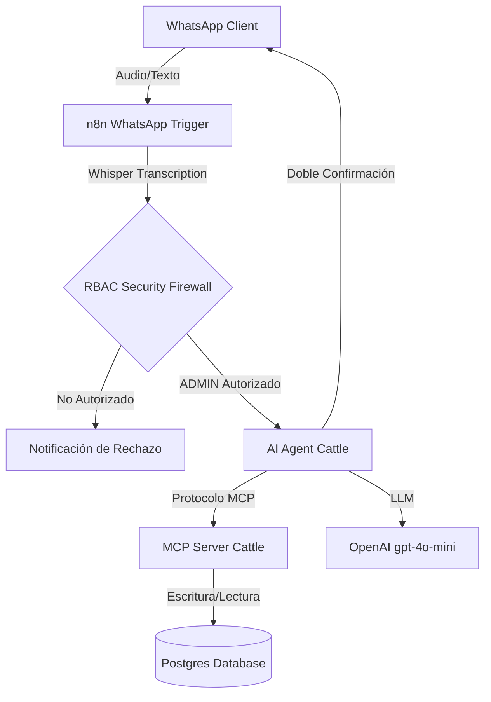

# 🐄 MCP Server Cattle Architecture (WhatsApp Field Agent)

## 🧜‍♂️ Diagrama de Arquitectura


## 🧠 Protocolo MCP (Herramientas Expuestas)

El servidor expone el siguiente conjunto de herramientas (Tools) diseñadas para la gestión transaccional del rancho y la captura de datos en el corral:

* **get_livestock_info**: Resuelve el UUID y consulta el estatus actual, categoría y peso de un animal utilizando su arete SINIIGA o Número de Fuego.
* **log_cattle_weight**: Registra transaccionalmente el pesaje de biomasa de un animal.
* **log_health_event**: Documenta eventos sanitarios, tratamientos y vacunaciones.
* **register_ranch_expense**: Registra gastos de operación e insumos del rancho.
* **get_table_metadata**: Diccionario de datos para descubrimiento dinámico de esquemas relacionales.

## 🛡️ Seguridad y Gobernanza de Datos (Fase 12-Meses)

Este agente opera bajo estrictos protocolos de integridad para evitar la inyección de datos basura (GIGO):

1. **RBAC Telefónico**: Validación nativa contra PostgreSQL. Solo los números telefónicos registrados con el rol `ADMIN` pueden accesar al motor de Inteligencia Artificial.
2. **Zero-Hallucination**: Directivas de *Prompt Engineering* que prohíben al LLM asumir parámetros faltantes en las base de datos (Ej. deducir categorías de salud a partir de lenguaje ambiguo).
3. **Human-in-the-Loop**: Candado *Anti-Jailbreak* que bloquea las herramientas de inserción SQL. Exige una confirmación explícita (Sí/No) por parte del caporal antes de alterar la base de datos.

## 🔌 Mapa de Dependencias

* **LLM Utilizado**: OpenAI (`gpt-4o-mini` para razonamiento, `Whisper` para procesamiento de notas de voz en campo).
* **Base de Datos**: Postgres (Manejo de UUIDs, Vistas SQL y JSONB).
* **Orquestador**: n8n v2.4.6.

## 📖 Interface de API

El cliente (Web Chat o WhatsApp Agent) debe enviar el siguiente JSON para activar el servidor MCP:

```json
{ "messages": [...], "action": "chat" }

```

## 🚀 Instalación

Para conectar el orquestador con el servidor de herramientas ganaderas:

1. Asegúrate de que el flujo `v6_MCP_Server_Cattle` esté activo en n8n.
2. Configura el nodo *MCP Client* en tu Agente IA para apuntar al endpoint oficial: `https://n8n.hosting3m.com/mcp/v6/cattle-management`.

```