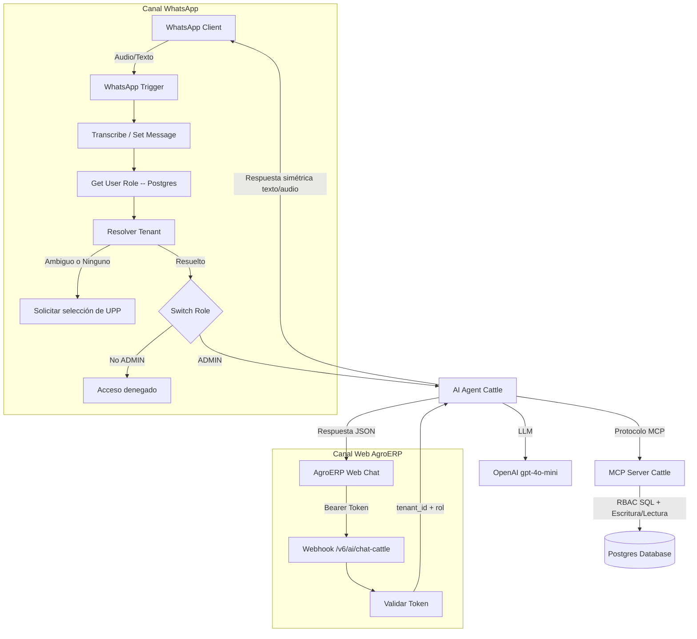

# 🐄 MCP Server Cattle Architecture (WhatsApp Field Agent + AgroERP Web Chat)

Este directorio contiene un servidor de herramientas MCP (`v6_MCP_Server_Cattle`) compartido por **dos agentes de IA distintos**:

* **WhatsApp Agent** (`v6_WhatsApp_Agent_Cattle`): captura de campo vía WhatsApp (texto/audio), con resolución de identidad por número telefónico.
* **AgroERP Web Chat** (`v6_ai_chat_cattle`): chat embebido en `https://agroerp.hosting3m.com`, con autenticación por Bearer token vía la sub-rutina `v3/SW ValidaToken`.

Ambos agentes comparten el mismo endpoint MCP (`/mcp/v6/cattle-management`) y el mismo motor de reglas de negocio en Postgres, pero **no comparten el mismo nivel de gobernanza de prompt** — ver la sección de Seguridad para el detalle.

## 🧜‍♂️ Diagrama de Arquitectura


## 🧠 Protocolo MCP (Herramientas Expuestas)

El servidor (`v6_MCP_Server_Cattle`) expone 5 herramientas (Tools) vía `mcpTrigger` en el path `v6/cattle-management`:

* **get_livestock_info**: busca un animal por `identificador` (arete SINIIGA o número de fuego) dentro del `tenant_id` del usuario. Si la búsqueda regresa más de un registro, la herramienta está diseñada para que el agente detenga el flujo y pida al usuario que aclare (categoría/especie) en vez de adivinar.
* **log_cattle_weight**: registra el pesaje (`livestock_id`, `weight_kg`). **Requiere `role = 'ADMIN'`** — este chequeo está en el `WHERE EXISTS` de la query SQL, no solo en el prompt, así que aplica sin importar qué canal invoque la herramienta.
* **log_health_event**: registra eventos de salud/vacunación (`livestock_id`, `event_type`, `description`). También exige `role = 'ADMIN'` a nivel SQL.
* **register_ranch_expense**: registra gastos de rancho (`tenant_id`, `category`, `amount`, `description`). ⚠️ A diferencia de las dos anteriores, esta query **no valida el rol del usuario** en el `WHERE EXISTS` — solo confirma que el email pertenece a un `user_companies` activo del tenant. Cualquier usuario autenticado con acceso al tenant puede registrar gastos, sin importar si es ADMIN o EDITOR.
* **get_table_metadata**: diccionario de datos (`crud_models`) para descubrimiento dinámico de esquema de cualquier tabla (ej. `cattle_expenses`, `cattle_health_logs`, `cattle_livestock`).

## 🛡️ Seguridad y Gobernanza de Datos (Fase 12-Meses)

1. **Resolución de identidad por canal**:
   - *WhatsApp*: `Get User Role` busca el rol/tenant por número telefónico contra Postgres.
   - *Web Chat*: la sub-rutina `v3/SW ValidaToken` valida el `Authorization` header y resuelve `tenant_id` y rol a partir del token — no depende de un número telefónico.

2. **Gatekeeper de Multi-Tenancy (WhatsApp)**: cuando un número está vinculado a más de una UPP, el nodo `Resolver Tenant` (Code) calcula de forma determinista si el tenant quedó resuelto, ambiguo o ausente, y el `IF - Bloquear Tenant Ambiguo` corta el flujo **antes** de llegar al `AI Agent` si no hay un único tenant claro — pidiendo al usuario que seleccione la UPP en vez de dejar que el LLM decida.

3. **RBAC a nivel de aplicación**:
   - *WhatsApp*: `Switch Role` solo deja pasar al `AI Agent` a usuarios con `role = 'ADMIN'`; el resto recibe un mensaje de acceso denegado antes de gastar tokens del LLM.
   - *Web Chat*: el propio `systemMessage` implementa una regla de RBAC más granular por herramienta (ADMIN puede leer y escribir; EDITOR solo puede usar `get_livestock_info`), ya que este canal sí permite el acceso de roles no-ADMIN al agente.

4. **RBAC a nivel SQL (defensa en profundidad)**: `log_cattle_weight` y `log_health_event` re-validan `role = 'ADMIN'` directamente en la query, independientemente de lo que decida el LLM o el gate de n8n. `register_ranch_expense` **no tiene este segundo candado** — queda pendiente como brecha conocida si se requiere restringir el registro de gastos solo a ADMIN.

5. **Zero-Hallucination**: ambos prompts prohíben inferir parámetros faltantes (ej. `event_type`) — el agente debe preguntar explícitamente antes de armar el resumen de guardado.

6. **Identificación biométrica**: se prioriza `electronic_rfid` (bolo ruminal/microchip) sobre el arete SINIIGA/número de fuego cuando el usuario provee ambos; SINIIGA/fuego queda como identificador secundario (documentado tanto en el `systemMessage` del WhatsApp Agent como en las notas del nodo `Transcribe`).

7. **Human-in-the-Loop / Doble Confirmación**: implementado **solo en el AI Agent del Web Chat** (`v6_ai_chat_cattle`) — exige que el último mensaje del usuario sea una confirmación afirmativa explícita antes de invocar cualquier herramienta de escritura. **El WhatsApp Agent todavía no tiene esta regla en su prompt** — es una diferencia real entre canales, no un descuido de este README.

## 🔌 Mapa de Dependencias

* **LLM Utilizado**: OpenAI (`gpt-4o-mini` para razonamiento, `Whisper` para transcripción de notas de voz en el canal WhatsApp).
* **Base de Datos**: Postgres (UUIDs, Vistas SQL, JSONB, y RBAC embebido en las queries de escritura).
* **Orquestador**: n8n.
* **Sub-rutina de autenticación**: `v3/SW ValidaToken` (workflow `RSz6L3aXj3NfumwG`) — usada exclusivamente por el canal Web Chat para validar el Bearer token y resolver `tenant_id`/rol.
* **Workflow de errores**: `9SrVXdATmlrZemJT`, configurado en los tres workflows (`errorWorkflow`).

## 📖 Interface de API

### Canal WhatsApp
Disparado por el trigger nativo de WhatsApp (`v6_WhatsApp_Agent_Cattle`) — no requiere invocación manual, procesa directamente los mensajes entrantes de Meta.

### Canal Web Chat (AgroERP)
```
POST https://n8n.hosting3m.com/webhook/v6/ai/chat-cattle
Authorization: Bearer <token>
Content-Type: application/json

{
  "chatInput": "texto del usuario",
  "sessionId": "opcional, para mantener memoria de conversación"
}
```

Respuesta:
```json
{ "output": "texto de respuesta del agente" }
```

Orígenes permitidos (CORS): `https://agroerp.hosting3m.com`, `http://localhost:4200`.

### Servidor MCP (uso interno)
El cliente (WhatsApp Agent o Web Chat Agent) se conecta como MCP Client al siguiente endpoint para invocar las herramientas descritas arriba:
```json
{ "messages": [...], "action": "chat" }
```

## 🚀 Instalación

Para conectar cualquier orquestador con el servidor de herramientas ganaderas:

1. Asegúrate de que `v6_MCP_Server_Cattle` esté activo en n8n.
2. Configura el nodo *MCP Client* del agente correspondiente (WhatsApp o Web Chat) para apuntar al endpoint oficial: `https://n8n.hosting3m.com/mcp/v6/cattle-management`.
3. Si vas a habilitar el canal Web Chat, confirma que la sub-rutina `v3/SW ValidaToken` (workflow `RSz6L3aXj3NfumwG`) esté activa y accesible desde `v6_ai_chat_cattle`, y que el dominio consumidor esté incluido en `allowedOrigins` del nodo `Webhook`.
