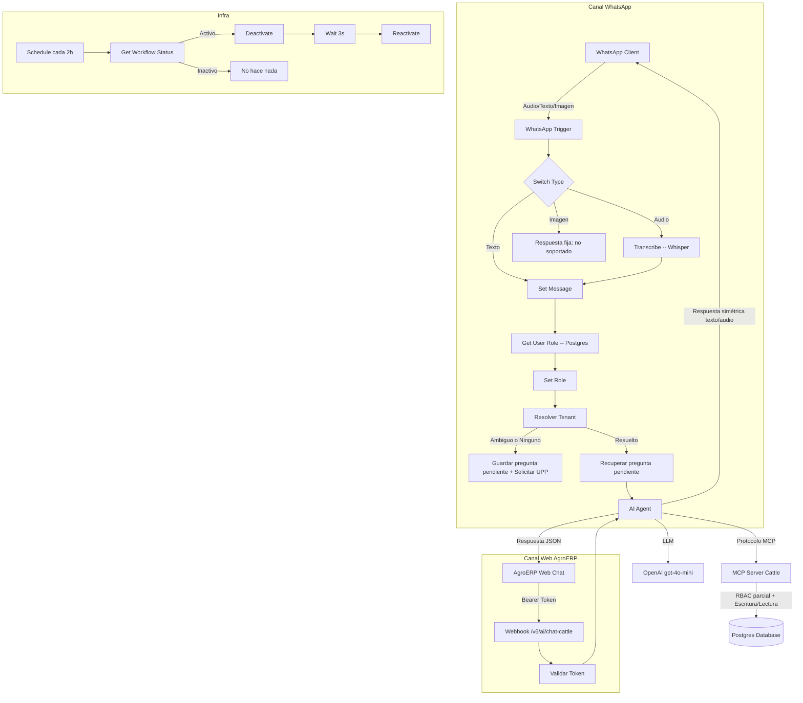

# 🐄 MCP Server Cattle Architecture (WhatsApp Field Agent + AgroERP Web Chat + Infra Watchdog)

Este directorio contiene un servidor de herramientas MCP (`v6_MCP_Server_Cattle`) compartido por **dos agentes de IA distintos**, más un workflow de infraestructura que mantiene vivo el canal WhatsApp:

* **WhatsApp Agent** (`v6_WhatsApp_Agent_Cattle`): captura de campo vía WhatsApp (texto/audio), con resolución de identidad por número telefónico.
* **AgroERP Web Chat** (`v6_ai_chat_cattle`): chat embebido en `https://agroerp.hosting3m.com`, con autenticación por Bearer token vía la sub-rutina `v3/SW ValidaToken`.
* **Infra Watchdog** (`v6/infra-whatsapp-trigger-resync`): reinicia periódicamente el workflow de WhatsApp para evitar que su suscripción de webhook con Meta se caiga silenciosamente.

Ambos agentes comparten el mismo endpoint MCP (`/mcp/v6/cattle-management`) y el mismo motor de reglas de negocio en Postgres, pero **no comparten el mismo nivel de gobernanza de rol** — ver la sección de Seguridad, en particular el hallazgo crítico del canal WhatsApp.

## 🧜‍♂️ Diagrama de Arquitectura


## 🧠 Protocolo MCP (Herramientas Expuestas)

El servidor (`v6_MCP_Server_Cattle`) expone **10 herramientas** vía `mcpTrigger` en el path `v6/cattle-management`. RBAC/tenant descrito abajo es lo que la query real hace hoy, verificado línea por línea contra el JSON — no lo que se asumía antes.

* **get_livestock_info**: busca un animal por `identificador` (arete SINIIGA, número de fuego o `electronic_rfid`) dentro del `tenant_id` del usuario. Valida `EXISTS` sobre `user_companies`/`users`/`is_active` (pertenencia al tenant), sin chequeo de rol — es de solo lectura, cualquier rol autenticado puede usarla. Si devuelve más de un registro, el agente debe detener el flujo y pedir que se aclare por categoría/especie.
* **log_cattle_weight**: registra el pesaje (`livestock_id`, `weight_kg`). Su `WHERE EXISTS` valida pertenencia al tenant (`user_companies`/`users`/`is_active`) — **no valida `role` en absoluto**. ⚠️ Esto contradice lo que este README describía antes ("requiere `role = 'ADMIN'` en el `WHERE EXISTS`"); confirmado leyendo la query real. Queda pendiente decidir si se agrega el chequeo de rol al SQL o si el control de rol vive solo en el prompt (ver Seguridad, punto 1).
* **log_health_event**: registra eventos de salud/vacunación (`livestock_id`, `event_type`, `description`). Mismo patrón que `log_cattle_weight`: valida tenant, **no valida rol**.
* **register_ranch_expense**: registra gastos (`tenant_id`, `category`, `amount`, `description`). Valida solo que el email pertenezca a un `user_companies` activo del tenant — sin chequeo de rol, brecha ya conocida desde antes de este commit.
* **get_table_metadata**: diccionario de datos (`crud_models`) para descubrir el esquema de cualquier tabla. Sin chequeo de tenant ni rol — es metadata global, no datos de un tenant específico.
* **log_weaning_event** *(nueva en este commit, no documentada hasta ahora)*: invoca `sp_register_weaning_event(p_id_company, p_livestock_id, p_weaning_date, p_weaning_method, p_reported_by_email, p_weight_kg, p_notes)`. Solo aplica a categorías BECERRO/BECERRA/BUCERRO/BUCERRA/POTRO/POTRANCA/BORREGO/BORREGA con `current_status = 'ACTIVO'`, una sola vez por animal. Rutinaria, sin confirmación previa. Sin `WHERE EXISTS` visible en el nodo — la validación de tenant, si existe, ocurre dentro del SP (no verificable desde este archivo).
* **register_birth_event**: invoca `sp_register_birth_event`, versión de 13 parámetros (`p_lot_id` incluido). Acepta a la madre por `dam_id` (UUID ya resuelto) o `dam_ear_tag`/`dam_fire_number` en texto libre. Todos los UUID opcionales (`dam_id`, `lot_id`, `production_unit_id`, `paddock_id`) están envueltos con la función `empty()` (blindaje contra `""` → `::uuid`, como pide `CLAUDE.md` Regla 11). Rutinaria, sin confirmación previa.
* **log_mortality_event**: invoca `sp_solicitar_autorizacion(..., p_tipo_evento := 'BAJA_MORTANDAD', ...)` — **no ejecuta la baja**, crea una solicitud pendiente de aprobación ADMIN. `causa_mortandad` debe ser exactamente uno de `ENFERMEDAD/ACCIDENTE/DEPREDACIÓN/DESCONOCIDA/NATURAL`. Usa `empty()` para `livestock_id` opcional (alimentado por `find_calf_by_dam`). **Requiere confirmación explícita** del usuario en el turno inmediato anterior (ver Seguridad, punto 6). ⚠️ **Bug de prompt en la propia tool, a corregir en el JSON:** su descripción dice *"same protocol as log_health_event and register_ranch_expense"* — falso, ambas tools son rutinarias sin confirmación según su propia descripción y según ambos system prompts. Debe decir `request_livestock_sale`, la única otra tool que sí comparte este protocolo.
* **request_livestock_sale**: mismo patrón que `log_mortality_event` pero `p_tipo_evento := 'VENTA'`, sin `p_payload` (no lo requiere). Coexiste con la venta directa del panel Web (`salida_ganado`), que no pasa por autorización. Requiere confirmación explícita.
* **find_calf_by_dam**: busca crías sin ningún identificador físico (los 3 `NULL`) nacidas de una madre dada en los últimos 90 días. ⚠️ **Es la única tool de datos sensibles del archivo sin `JOIN user_companies`/`users` para validar que el usuario realmente pertenece al `tenant_id` recibido** — filtra directo por `cl.tenant_id = $1`, dependiendo 100% de que el parámetro llegue correcto desde el LLM. Es exactamente el mecanismo detrás del hallazgo v1.12.0 de aislamiento multi-tenant (ver Seguridad, punto 7): aquí no hay red de seguridad SQL si el LLM manda el tenant equivocado, a diferencia de sus tools hermanas de lectura/escritura.

## 🛡️ Seguridad y Gobernanza de Datos

### 1. 🔴 CRÍTICO — no existe ningún gate de rol en el canal WhatsApp
La versión anterior de este README describía un nodo `Switch Role` que bloqueaba a no-ADMIN antes de llegar al `AI Agent`. **Ese nodo no existe en el workflow actual.** El flujo real es `Get User Role` (Postgres) → `Set Role` (guarda `role = global_role || 'GUEST'`) → `Resolver Tenant` → `AI Agent` — **el campo `role` se calcula pero nunca se vuelve a leer en ningún nodo `IF` ni en el `systemMessage` del agente**. A diferencia del Web Chat, cuyo prompt sí tiene una sección explícita de RBAC (ver punto 3 abajo), el prompt de WhatsApp no menciona `role`/`ADMIN`/`EDITOR` en ningún lado.

**Consecuencia real y verificada:** un usuario con rol EDITOR (con acceso legítimo a un tenant real) puede hoy, por WhatsApp, invocar las 7 herramientas de escritura — incluyendo `log_mortality_event`/`request_livestock_sale` — sin que ningún nivel (n8n, prompt o SQL, ver punto 2) se lo impida. Por Web Chat ese mismo usuario queda correctamente restringido a solo lectura. El cálculo de `global_role` sin uso posterior sugiere que el gate existió y se perdió en algún punto — no un diseño intencional. **Pendiente de decisión del equipo:** reintroducir el gate a nivel de nodo n8n, replicar la regla de RBAC del prompt de Web Chat en el de WhatsApp, o ambos.

### 2. RBAC a nivel SQL — parcial, no lo que se documentaba antes
Solo `get_livestock_info` (lectura), `log_cattle_weight` y `log_health_event` validan pertenencia al tenant vía `JOIN user_companies`/`users`/`is_active` en el propio nodo Postgres. **Ninguna de las 10 tools valida `role` en SQL.** `register_ranch_expense` y `find_calf_by_dam` son las más expuestas: la primera sin chequeo de rol (ya documentado), la segunda sin chequeo de tenant siquiera (ver arriba). Las tools que invocan un SP (`log_weaning_event`, `register_birth_event`, `log_mortality_event`, `request_livestock_sale`) no muestran validación en el nodo — si existe, vive dentro del SP y no es verificable desde este archivo.

### 3. RBAC a nivel de prompt (Web Chat únicamente)
El `systemMessage` de `v6_ai_chat_cattle` sí implementa RBAC por rol: si `role != 'ADMIN'`, tiene **estrictamente prohibido** invocar las 7 tools de escritura, y debe responder que su rol solo tiene permiso de consulta. `get_livestock_info` es la única explícitamente permitida para cualquier rol. ⚠️ **`find_calf_by_dam` y `get_table_metadata` no están en la lista de bloqueo ni en la de permitidas** — ambigüedad menor: un EDITOR no está explícitamente bloqueado de usar `find_calf_by_dam` (que expone datos reales de crías del tenant), aunque no puede encadenarla a una escritura porque esas sí están bloqueadas.

### 4. Resolución de identidad por canal
* *WhatsApp*: `Get User Role` busca por número telefónico (últimos 10 dígitos) contra Postgres, calculando `global_role` (`ADMIN` si el teléfono tiene ADMIN en cualquier empresa asociada, si no `EDITOR`) y el arreglo de `available_tenants`.
* *Web Chat*: la sub-rutina `v3/SW ValidaToken` (workflow `RSz6L3aXj3NfumwG`) valida el `Authorization` header y resuelve `tenant_id`/rol a partir del token.

### 5. Gatekeeper de Multi-Tenancy (WhatsApp) — más completo de lo documentado antes
El nodo `Resolver Tenant` (Code) determina si el tenant quedó `resolved`, `ambiguous` o `none`, con esta prioridad: (a) coincidencia del nombre de la UPP mencionada en el mensaje actual, (b) selección previa persistida (`user_tenant_selection`, por teléfono), (c) si solo hay una UPP, se usa esa. `IF - Bloquear Tenant Ambiguo` corta el flujo **antes** del `AI Agent` si no quedó resuelto — pidiendo al usuario que indique la UPP. Detalle no documentado antes: **la pregunta original del usuario no se pierde** — se guarda en `pending_user_query` y se recupera (`Recuperar Pregunta Pendiente` → `Set Prompt Final`) en cuanto el tenant queda resuelto, para no obligar al usuario a repetir su solicitud completa.

### 6. Protocolo de Confirmación (Human-in-the-Loop) — ya presente en AMBOS canales
✅ **Actualización respecto a este README antes:** el WhatsApp Agent **ya tiene** el mismo candado que Web Chat — solo `log_mortality_event` y `request_livestock_sale` exigen que el último mensaje del usuario sea una confirmación afirmativa explícita antes de invocarse; el resto de tools de escritura son rutinarias. (Recordatorio: la propia descripción de `log_mortality_event` en el JSON del MCP Server tiene un error de copy-paste sobre esto — ver la lista de tools arriba.)

### 7. `tenant_id` — mitigación v1.12.0 confirmada en ambos prompts
Ambos system prompts repiten el valor **literal** del tenant (no una variable genérica) justo antes del diccionario de herramientas — `{{ $('Validar Token').item.json.data.id_company }}` en Web Chat, `{{ $('Resolver Tenant').item.json.tenant_id }}` en WhatsApp — y ambos incluyen explícitamente `find_calf_by_dam` en la lista de tools que deben usarlo "sin excepción". Sigue siendo mitigación de prompt, no garantía de arquitectura (ver `CLAUDE.md`, Regla 6).

### 8. Zero-Hallucination
Ambos prompts prohíben inferir parámetros faltantes. El prompt de WhatsApp agrega una regla 1.b exclusiva: nunca responder sobre un animal usando el historial de la conversación — debe re-ejecutar `get_livestock_info` en cada turno en que se pregunte por él, aunque ya se haya consultado antes en la misma sesión.

### 9. Identificación biométrica
Se prioriza `electronic_rfid` sobre SINIIGA/número de fuego cuando el usuario provee ambos — documentado tanto en el `systemMessage` de WhatsApp como en las notas del nodo `Transcribe`. Recordatorio de `CLAUDE.md` Regla 2: en la práctica el arete SINIIGA es el identificador que realmente cubre al hato (97% sin bolo ruminal).

### 10. Riesgo de pruebas contra producción
El panel "Test <tool>" de un nodo `postgresTool` y el panel "Chat" interno del editor de n8n ejecutan contra la base real, sin distinguir si la instancia es local o de producción. Toda prueba conversacional debe usar el tenant ficticio de pruebas (`id_company = 3`, "Pista de Hielo") y hacerse por el canal real (WhatsApp o Web Chat), nunca desde el editor de n8n.

## 🎙️ Manejo de entrada/salida por canal (WhatsApp)

* **Texto**: procesado directo.
* **Audio**: transcrito con Whisper (`Transcribe`, notas del nodo con la regla de sanitización de aretes e identificación biométrica); si el mensaje entrante fue audio, la respuesta también se genera como nota de voz (TTS), si fue texto, la respuesta es texto — decidido por el nodo `If` según `Transcribe.isExecuted`.
* **Imagen**: no soportada — responde con un mensaje fijo pidiendo comunicación por texto o audio, sin invocar al Agente ni gastar tokens del LLM.

## 🔌 Mapa de Dependencias

* **LLM Utilizado**: OpenAI (`gpt-4o-mini` para razonamiento, `Whisper` para transcripción y síntesis de audio en el canal WhatsApp).
* **Base de Datos**: Postgres (UUIDs, Vistas SQL, JSONB; RBAC de tenant embebido de forma inconsistente entre tools — ver Seguridad).
* **Orquestador**: n8n.
* **Sub-rutina de autenticación**: `v3/SW ValidaToken` (workflow `RSz6L3aXj3NfumwG`) — usada exclusivamente por el canal Web Chat.
* **API de n8n (uso interno de infraestructura)**: consumida por `v6/infra-whatsapp-trigger-resync` vía credencial `n8n account` para activar/desactivar el workflow de WhatsApp.
* **Workflow de errores**: `9SrVXdATmlrZemJT` — confirmado configurado en `v6/infra-whatsapp-trigger-resync`; heredado de versiones anteriores de este README como configurado también en los otros tres workflows, pero no confirmable desde los exports revisados en este commit (no incluyen el bloque `settings`).
* **`v6/infra-whatsapp-trigger-resync`** (nuevo): reinicia el workflow de WhatsApp (id `lqgFIeTbSdPRT8zz`) cada 2 horas — lo desactiva, espera 3 segundos y lo reactiva, para refrescar la suscripción del webhook con Meta antes de que se caiga silenciosamente. Solo actúa si encuentra el workflow **activo**; si lo encuentra inactivo, no hace nada (no es un mecanismo de recuperación ante una caída real, solo preventivo). ⚠️ **El propio workflow trae `"active": false` en este export** — confirmar que se activó manualmente en n8n tras el deploy, o el watchdog nunca corre.

## 📖 Interface de API

### Canal WhatsApp
Disparado por el trigger nativo de WhatsApp (`v6_WhatsApp_Agent_Cattle`) — no requiere invocación manual, procesa directamente los mensajes entrantes de Meta. Mantenido vivo por `v6/infra-whatsapp-trigger-resync` (ver arriba).

### Canal Web Chat (AgroERP)
```
POST https://n8n.hosting3m.com/webhook/v6/ai/chat-cattle
Authorization: Bearer <token>
Content-Type: application/json

{
  "chatInput": "texto del usuario",
  "sessionId": "opcional, para mantener memoria de conversación"
}
```

Respuesta:
```json
{ "output": "texto de respuesta del agente" }
```

Orígenes permitidos (CORS): `https://agroerp.hosting3m.com`, `http://localhost:4200`.

⚠️ **Detalle menor confirmado en el JSON:** si `sessionId` no llega, la memoria de conversación cae a la clave fija `'test-session-123'` — si dos llamadas distintas omitieran `sessionId` al mismo tiempo, compartirían memoria. Verificar que el frontend real siempre lo mande.

### Servidor MCP (uso interno)
El cliente (WhatsApp Agent o Web Chat Agent) se conecta como MCP Client al siguiente endpoint para invocar las 10 herramientas descritas arriba:
```json
{ "messages": [...], "action": "chat" }
```

## 🚀 Instalación

Para conectar cualquier orquestador con el servidor de herramientas ganaderas:

1. Asegúrate de que `v6_MCP_Server_Cattle` esté activo en n8n.
2. Configura el nodo *MCP Client* del agente correspondiente (WhatsApp o Web Chat) para apuntar al endpoint oficial: `https://n8n.hosting3m.com/mcp/v6/cattle-management`.
3. Si vas a habilitar el canal Web Chat, confirma que la sub-rutina `v3/SW ValidaToken` (workflow `RSz6L3aXj3NfumwG`) esté activa y accesible desde `v6_ai_chat_cattle`, y que el dominio consumidor esté incluido en `allowedOrigins` del nodo `Webhook`.
4. **Activa manualmente `v6/infra-whatsapp-trigger-resync`** en n8n — el export trae el workflow desactivado por default; sin activarlo, la suscripción del webhook de WhatsApp con Meta queda sin protección contra caídas silenciosas.
5. Antes de dar por cerrado este commit, resolver el hallazgo crítico de RBAC en WhatsApp (Seguridad, punto 1) — hoy cualquier EDITOR autenticado tiene efectivamente permisos de escritura completos por ese canal.