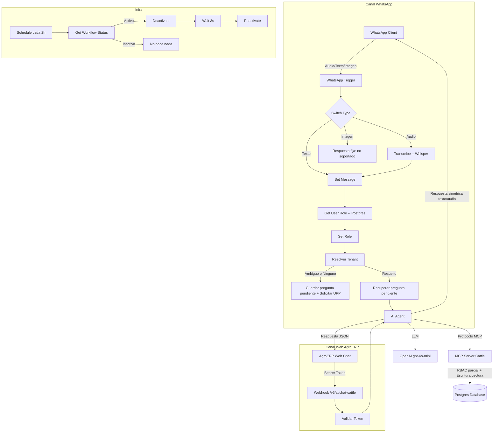

# 🐄 MCP Server Cattle Architecture (WhatsApp Field Agent + AgroERP Web Chat + Infra Watchdog)

Este directorio contiene un servidor de herramientas MCP (`v6_MCP_Server_Cattle`) compartido por **dos agentes de IA distintos**, más un workflow de infraestructura que mantiene vivo el canal WhatsApp:

* **WhatsApp Agent** (`v6_WhatsApp_Agent_Cattle`): captura de campo vía WhatsApp (texto/audio), con resolución de identidad por número telefónico.
* **AgroERP Web Chat** (`v6_ai_chat_cattle`): chat embebido en `https://agroerp.hosting3m.com`, con autenticación por Bearer token vía la sub-rutina `v3/SW ValidaToken`.
* **Infra Watchdog** (`v6/infra-whatsapp-trigger-resync`): reinicia periódicamente el workflow de WhatsApp para evitar que su suscripción de webhook con Meta se caiga silenciosamente.

Ambos agentes comparten el mismo endpoint MCP (`/mcp/v6/cattle-management`) y el mismo motor de reglas de negocio en Postgres, pero **no comparten el mismo nivel de gobernanza de rol** — ver la sección de Seguridad, en particular el hallazgo crítico del canal WhatsApp.

## 🧜‍♂️ Diagrama de Arquitectura

```mermaid
graph TD
    subgraph Canal WhatsApp
        A1[WhatsApp Client] -->|Audio/Texto/Imagen| B1[WhatsApp Trigger]
        B1 --> SW{Switch Type}
        SW -->|Audio| TR[Transcribe -- Whisper]
        SW -->|Texto| C1[Set Message]
        SW -->|Imagen| IMG[Respuesta fija: no soportado]
        TR --> C1
        C1 --> D1[Get User Role -- Postgres]
        D1 --> SR[Set Role]
        SR --> E1[Resolver Tenant]
        E1 -->|Ambiguo o Ninguno| F1[Guardar pregunta pendiente + Solicitar UPP]
        E1 -->|Resuelto| RQ[Recuperar pregunta pendiente]
        RQ --> M[AI Agent]
    end
    subgraph Canal Web AgroERP
        A2[AgroERP Web Chat] -->|Bearer Token| B2[Webhook /v6/ai/chat-cattle]
        B2 --> C2[Validar Token]
        C2 --> M
    end
    subgraph Infra
        WD[Schedule cada 2h] --> WS[Get Workflow Status]
        WS -->|Activo| DE[Deactivate] --> WT[Wait 3s] --> RE[Reactivate]
        WS -->|Inactivo| NOOP[No hace nada]
    end
    M -->|Protocolo MCP| N[MCP Server Cattle]
    N -->|RBAC parcial + Escritura/Lectura| O[(Postgres Database)]
    M -->|LLM| P[OpenAI gpt-4o-mini]
    M -->|Respuesta simétrica texto/audio| A1
    M -->|Respuesta JSON| A2
```

## 🧠 Protocolo MCP (Herramientas Expuestas)

El servidor (`v6_MCP_Server_Cattle`) expone **15 herramientas** vía `mcpTrigger` en el path `v6/cattle-management` — confirmado contando los 15 nodos `postgresTool` reales del export y sus 15 conexiones `ai_tool` hacia el nodo `MCP Server Cattle` (2026-09-26; corrige el conteo de 11 que este README manejaba antes).

* **get_livestock_info**: busca un animal por `identificador` (arete SINIIGA, número de fuego o `electronic_rfid`) dentro del `tenant_id` del usuario. Valida `EXISTS` sobre `user_companies`/`users`/`is_active` (pertenencia al tenant), sin chequeo de rol — es de solo lectura, cualquier rol autenticado puede usarla. Si devuelve más de un registro, el agente debe detener el flujo y pedir que se aclare por categoría/especie.
* **log_cattle_weight**: registra el pesaje (`livestock_id`, `weight_kg`). Su `WHERE EXISTS` valida pertenencia al tenant (`user_companies`/`users`/`is_active`) — **no valida `role` en absoluto**.
* **log_health_event**: registra eventos de salud **NO especializados** (enfermedad, revisión clínica, tratamiento genérico) — `livestock_id`, `event_type` (MAYÚSCULAS, ej. `ENFERMEDAD`/`REVISION`/`LESION`/`TRATAMIENTO`), `description`. Su INSERT solo llena `livestock_id`/`event_type`/`description`/`event_date` (`CURRENT_TIMESTAMP`) — **no acepta `medicines_json`**. Su propia `toolDescription` (confirmado leyendo el JSON real) prohíbe explícitamente usarla para vacunación, suplementos o palpaciones, remitiendo a las tools especializadas de abajo.
* **log_vaccination_event**: registra la aplicación de una vacuna con campos estructurados. Resuelve el animal directamente por `animal_identifier` (arete SINIIGA, RFID electrónico o número de fuego) en su propio CTE — no requiere `get_livestock_info` previo. Parámetros: `tenant_id`, `user_email`, `animal_identifier`, `vaccine_name`, `dose`, `dose_unit`, `application_date` (opcional), `next_application_date` (opcional), `notes` (opcional). INSERT en `cattle_health_logs` con `event_type = 'VACUNA'` y `medicines_json = {vaccine_name, dose, dose_unit, next_application_date}`. Fail-closed vía `auth_check`/`target_animal`. ✅ **`event_date` corregido y verificado en LOCAL y PRODUCCIÓN (2026-09-25/26):** `COALESCE(application_date::timestamp, CURRENT_TIMESTAMP)`, ya no usa `CURRENT_DATE`.
* **log_supplement_event** *(documentada por primera vez el 2026-09-26 — confirmada leyendo el JSON completo, antes solo sospechada)*: registra la aplicación de un suplemento (mineral, vitamínico, etc.), mismo patrón exacto que `log_vaccination_event` (resuelve `animal_identifier` internamente, mismo `auth_check`/`target_animal`). Parámetros: `animal_identifier`, `supplement_name`, `dose`, `dose_unit`, `application_date` (opcional), `notes` (opcional). INSERT con `event_type = 'SUPLEMENTO'` y `medicines_json = {supplement_name, dose, dose_unit}`. ✅ **`event_date` corregido y verificado en LOCAL y PRODUCCIÓN (2026-09-27):** mismo fix que `log_vaccination_event` — `COALESCE(application_date::timestamp, CURRENT_TIMESTAMP)`.
* **log_palpation_event** *(documentada por primera vez el 2026-09-26 — confirmada leyendo el JSON completo, antes solo sospechada)*: registra una palpación **y actualiza `cattle_livestock.current_status`** en la misma transacción (INSERT + UPDATE encadenados vía CTE). `result` debe ser exactamente `PREÑADA` o `VACÍA` (con acento) — cualquier otro valor no inserta ni actualiza nada, forzado por `WHERE p.result IN ('PREÑADA', 'VACÍA')`. Parámetros: `animal_identifier`, `result`, `gestation_days` (opcional), `technician_name` (opcional), `notes` (opcional), `palpation_date` (opcional). ✅ **`event_date` corregido y verificado en LOCAL y PRODUCCIÓN (2026-09-27):** mismo fix que las dos tools anteriores.
* **register_ranch_expense**: registra gastos (`tenant_id`, `category`, `amount`, `description`). Valida solo que el email pertenezca a un `user_companies` activo del tenant — sin chequeo de rol.
* **get_table_metadata**: diccionario de datos (`crud_models`) para descubrir el esquema de cualquier tabla. Sin chequeo de tenant ni rol — es metadata global.
* **count_livestock** *(documentada por primera vez el 2026-09-26 — no se sospechaba su existencia hasta leer el JSON completo)*: cuenta animales del tenant actual con filtros opcionales por `lot_name`, `production_unit_name`, `category`, `current_status` (default `ACTIVO` si se omite) y `species`. Solo lectura, valida tenant vía `EXISTS`/`user_companies`/`users`. Devuelve conteo agrupado por categoría/estatus. Detalle notable: la propia query excluye explícitamente el nombre de la empresa/rancho del filtro `production_unit_name` (`NOT EXISTS (SELECT 1 FROM companys c WHERE ... c.company_name ILIKE p.production_unit_name)`) para que el LLM no confunda el tenant ya seleccionado con una UPP interna — un guardrail anti-alucinación implementado en SQL, no solo en el prompt.
* **register_livestock_purchase** *(documentada por primera vez el 2026-09-26 — no se sospechaba su existencia hasta leer el JSON completo)*: da de alta un animal comprado (no nacido en el rancho) en `cattle_livestock`. `business_model` es obligatorio y debe ser exactamente uno de `CRIA`/`ENGORDA`/`REPRODUCCION` (columna `NOT NULL`, sin default) — si el INSERT no devuelve filas, la causa más probable es un `business_model` inválido, y su `toolDescription` instruye explícitamente al LLM a **nunca confirmar el alta si la respuesta viene vacía**. Resuelve `production_unit_name`/`lot_name` por texto libre igual que `register_birth_event`. Precio, vendedor y fecha de compra quedan en `metadata` (jsonb).
* **log_weaning_event**: invoca `sp_register_weaning_event(...)`. Solo aplica a categorías BECERRO/BECERRA/BUCERRO/BUCERRA/POTRO/POTRANCA/BORREGO/BORREGA con `current_status = 'ACTIVO'`, una sola vez por animal. Rutinaria, sin confirmación previa.
* **register_birth_event**: invoca `sp_register_birth_event`, 13 parámetros. Acepta a la madre por `dam_id` (UUID) o `dam_ear_tag`/`dam_fire_number` en texto libre. UUID opcionales envueltos con `empty()`. Rutinaria, sin confirmación previa.
* **log_mortality_event**: invoca `sp_solicitar_autorizacion(..., p_tipo_evento := 'BAJA_MORTANDAD', ...)` — crea una solicitud pendiente de aprobación ADMIN, no ejecuta la baja. `causa_mortandad` debe ser exactamente uno de `ENFERMEDAD/ACCIDENTE/DEPREDACIÓN/DESCONOCIDA/NATURAL`. **Requiere confirmación explícita**. ⚠️ Su `toolDescription` en el JSON sigue diciendo *"same protocol as log_health_event and register_ranch_expense"* — sigue siendo un error de copy-paste sin corregir; debería decir `request_livestock_sale`.
* **request_livestock_sale**: mismo patrón que `log_mortality_event` pero `p_tipo_evento := 'VENTA'`. Requiere confirmación explícita.
* **find_calf_by_dam**: busca crías sin identificador físico nacidas de una madre en los últimos 90 días. Sigue siendo la única tool de datos sensibles del archivo **sin** `JOIN user_companies`/`users` — filtra directo por `cl.tenant_id = $1` (ver Seguridad, punto 7).

## 🛡️ Seguridad y Gobernanza de Datos

### 1. ✅ Ausencia de gate de rol — cerrada como diseño intencional (decisión de Francisco Pérez Pimienta, PM, 2026-09-20; NO confirmada todavía con el cliente final)
El Agente IA (WhatsApp/Web Chat) es una herramienta de captura de campo — EDITOR debe poder usar las tools rutinarias sin restricción de rol, por diseño. Las dos operaciones irreversibles (`log_mortality_event`/`request_livestock_sale`) tienen su gate real vía el protocolo de autorización asíncrona (Regla 10 de `CLAUDE.md`). El `Set Role`/`global_role` de WhatsApp queda como cálculo sin consumidor (deuda cosmética, no de seguridad).
⚠️ Decisión del PM, no del cliente final — tratarla como diseño vigente para desarrollo, pero no cerrarla en `CLAUDE.md` como "confirmado con el cliente" hasta tener esa confirmación.

### 2. RBAC a nivel SQL — parcial
`get_livestock_info`, `log_cattle_weight`, `log_health_event`, `log_vaccination_event`, `log_supplement_event`, `log_palpation_event`, `count_livestock` y `register_livestock_purchase` validan pertenencia al tenant vía `JOIN`/`EXISTS` sobre `user_companies`/`users`/`is_active` en el propio nodo Postgres. Ninguna de las 15 tools valida `role` en SQL — consistente con el punto 1. `register_ranch_expense` y `find_calf_by_dam` siguen siendo las más expuestas *en tenant* (ver punto 7).

### 3. RBAC a nivel de prompt — ninguno en ningún canal, por diseño (punto 1)
Ni el `systemMessage` de WhatsApp ni el de `v6_ai_chat_cattle` condicionan ninguna herramienta al valor de `role`.

### 4. Resolución de identidad por canal
* *WhatsApp*: `Get User Role` busca por número telefónico (últimos 10 dígitos), calculando `global_role` (`ADMIN` si el teléfono tiene ADMIN en cualquier empresa asociada, si no `EDITOR`) y `available_tenants`.
* *Web Chat*: la sub-rutina `v3/SW ValidaToken` (workflow `RSz6L3aXj3NfumwG`) valida el `Authorization` header. Es compartida entre módulos del monorepo (recibe `model_name`); para `model_name = 'hotel_reviews'` hace bypass público sin validar token — sin impacto conocido sobre el canal de ganado, que nunca manda ese `model_name`.

### 5. Gatekeeper de Multi-Tenancy (WhatsApp)
El nodo `Resolver Tenant` (Code) determina `resolved`/`ambiguous`/`none` con prioridad: (a) coincidencia de UPP mencionada en el mensaje actual, (b) selección previa persistida (`user_tenant_selection`), (c) única UPP disponible. `IF - Bloquear Tenant Ambiguo` corta el flujo antes del `AI Agent` si no quedó resuelto. La pregunta original del usuario se guarda en `pending_user_query` y se recupera una vez resuelto el tenant, sin obligar a repetirla.

### 6. Protocolo de Confirmación (Human-in-the-Loop) — ya presente en AMBOS canales
Solo `log_mortality_event` y `request_livestock_sale` exigen confirmación afirmativa explícita del último mensaje del usuario. Las 13 tools de escritura restantes son rutinarias, incluidas `log_vaccination_event`, `log_supplement_event`, `log_palpation_event` y `register_livestock_purchase` — aunque 3 de esas 4 tools ni siquiera aparecen mencionadas en el diccionario del prompt (ver punto 8bis).

### 7. `tenant_id` — mitigación v1.12.0
Ambos prompts repiten el valor literal del tenant justo antes del diccionario de herramientas, e incluyen explícitamente una lista de tools que deben usarlo "sin excepción" (con cláusula de cierre "aunque la herramienta no aparezca en esta lista en el futuro"). **Confirmado que esa lista explícita en ambos prompts no incluye `count_livestock`, `register_livestock_purchase`, `log_supplement_event` ni `log_palpation_event`** — cubiertas solo por la cláusula de cierre genérica, no por mención literal. Sigue siendo mitigación de prompt, no garantía de arquitectura.

### 8. Zero-Hallucination — reglas 4bis/5/6 confirmadas en ambos `systemMessage` reales
Ambos `systemMessage` ya incluyen la Regla 4bis (propagación obligatoria de `id` → `livestock_id`), Regla 5 (prohibición de excusas técnicas inventadas) y Regla 6 (prohibición de rechazos inventados en tools rutinarias), agregadas tras los tres patrones de alucinación observados en pruebas el 2026-09-25/26 sobre el tenant ficticio (`id_company = 3`, "Pista de Hielo", arete `71569901`): falso éxito sin tool call, excusa de negocio inventada sobre un error real de `livestock_id` vacío, y rechazo de negocio inventado sin ningún error de por medio. Estas reglas son mitigación de prompt sobre un modelo estocástico — no garantizan que no aparezca un cuarto patrón distinto.

### 8bis. ✅ Hallazgo (2026-09-26) resuelto (2026-09-27): 4 herramientas ya visibles en el diccionario de ambos prompts
`count_livestock`, `register_livestock_purchase`, `log_supplement_event` y `log_palpation_event` existían en el MCP Server y estaban correctamente conectadas, pero ninguna aparecía en el diccionario de herramientas de ningún `systemMessage` — mismo mecanismo que causó el bug original de vacunación. **Corregido el 2026-09-27** agregando las 4 tools al diccionario de ambos prompts (`v6_ai_chat_cattle`, `v6_WhatsApp_Agent_Cattle`), mismo patrón que se usó para `log_vaccination_event`. ✅ Verificado por el canal real en Web Chat (LOCAL y producción). ⚠️ **WhatsApp sin verificar todavía** (sin teléfono de pruebas disponible al momento de este commit) — el cambio de prompt es el mismo en ambos archivos, pero no se ha confirmado end-to-end por ese canal.

### 8ter. Bugs reales en `count_livestock`, encontrados en su primera prueba real (2026-09-27) — corregidos y verificados
Al probar `count_livestock` por primera vez por el canal real (recién visible tras el fix del punto 8bis), "¿cuántas vacas tengo?" devolvió 3 vacas contando una en `BAJA_MORTANDAD`, una `PREÑADA` y una `VACÍA` — ninguna en `ACTIVO`. Dos bugs reales, corregidos en dos pasos:

1. **`current_status` no aplicaba ningún default pese a que su `toolDescription` prometía uno** (`current_status (default ACTIVO si no se especifica)`): cuando el LLM omitía el parámetro, la condición SQL (`p.current_status IS NULL OR ...`) no filtraba nada — devolvía todos los estados, no solo `ACTIVO`.
2. **Primer intento de fix incorrecto:** forzar el default a `'ACTIVO'` literal (`COALESCE(NULLIF(...), 'ACTIVO')`) dejó la pregunta "¿cuántas vacas tengo?" en **0 resultados** — porque en este esquema una VACA adulta normalmente vive en `PREÑADA`/`VACÍA`, no en `ACTIVO` puro (confirmado contra el CHECK constraint real: `ACTIVO, EN_TRANSITO, VENDIDO, BAJA_MORTANDAD, PREÑADA, VACÍA, DESARROLLO, RIESGO, FINALIZADO, CUARENTENA, BAJA_DEPURACION_DATOS` — 11 valores posibles; uso real global: 317 `ACTIVO`, 145 `VACÍA`, 110 `PREÑADA`, 4 `BAJA_MORTANDAD`, 4 `VENDIDO`, 1 `RIESGO`).
3. **Fix correcto (decisión de negocio confirmada, 2026-09-27):** en vez de un default positivo a un solo valor, se excluyen explícitamente los 3 estados terminales cuando no se especifica estado — `VENDIDO`, `FINALIZADO`, `BAJA_DEPURACION_DATOS`. Todo lo demás (incluido `BAJA_MORTANDAD`, mientras la baja siga sin aprobar) cuenta como "lo tengo" por default.

⚠️ **Inconsistencia detectada durante la misma verificación, sin resolver:** el dashboard (`main-dashboard`, filtro "Estado: Activos") reportó **9** cabezas activas para el tenant de pruebas, mientras que `count_livestock` sin filtro reportó **11** — la diferencia son los 2 animales en `BAJA_MORTANDAD` (1 becerro, 1 vaca), que el Agente IA cuenta como "los tengo" mientras el dashboard aparentemente no. **Decisión del cliente (2026-09-27): la respuesta del Agente IA y el dashboard deben ser consistentes** — pendiente de revisar el componente/query del frontend para confirmar su criterio exacto y alinearlo con el de `count_livestock`. No corregido todavía.

### 9. Bug de `event_date` — corregido en las 3 tools que lo tenían
El bug (`COALESCE(fecha, CURRENT_DATE)` en vez de `CURRENT_TIMESTAMP`, que descuadraba el orden cronológico de `vw_cattle_event_log` frente a otros eventos del mismo día) se corrigió y verificó en LOCAL y PRODUCCIÓN en `log_vaccination_event` el 2026-09-25/26, y en `log_supplement_event`/`log_palpation_event` el 2026-09-27. Las 3 tools que escriben `event_date` en `cattle_health_logs` usan hoy el mismo patrón correcto (`COALESCE(fecha::timestamp, CURRENT_TIMESTAMP)`). Sin pendientes en este punto.

### 10. Identificación biométrica
Se prioriza `electronic_rfid` sobre SINIIGA/número de fuego cuando el usuario provee ambos. Recordatorio de `CLAUDE.md` Regla 2: en la práctica el arete SINIIGA es el identificador que realmente cubre al hato (97% sin bolo ruminal).

### 11. Riesgo de pruebas contra producción
El panel "Test <tool>" de un nodo `postgresTool` y el panel "Chat" interno del editor de n8n ejecutan contra la base real. Toda prueba conversacional debe usar el tenant ficticio de pruebas (`id_company = 3`, "Pista de Hielo") y hacerse por el canal real (WhatsApp o Web Chat), nunca desde el editor de n8n.

⚠️ **Nota de calidad de datos (2026-09-26)**: el animal de pruebas (arete `71569901`) quedó con `current_status = 'VACÍA'` pero su última `PALPACION` registrada dice `'PREÑADA'` — inconsistencia detectada durante pruebas, sin resolver. Dado que `log_palpation_event` SÍ actualiza `current_status` automáticamente, un estado inconsistente como este solo pudo originarse por una escritura fuera de esta tool (panel web, migración manual, o una prueba ejecutada directo desde el editor de n8n contra producción — ver el riesgo justo arriba). Si se sigue usando este animal para pruebas, tenerlo presente.

## 🎙️ Manejo de entrada/salida por canal (WhatsApp)

* **Texto**: procesado directo.
* **Audio**: transcrito con Whisper (`Transcribe`); si el mensaje entrante fue audio, la respuesta también se genera como nota de voz (TTS), si fue texto, la respuesta es texto — decidido por el nodo `If` según `Transcribe.isExecuted`.
* **Imagen**: no soportada — responde con un mensaje fijo pidiendo comunicación por texto o audio, sin invocar al Agente ni gastar tokens del LLM.

## 🔌 Mapa de Dependencias

* **LLM Utilizado**: OpenAI (`gpt-4o-mini` para razonamiento, `Whisper` para transcripción y síntesis de audio en el canal WhatsApp).
* **Base de Datos**: Postgres (UUIDs, Vistas SQL, JSONB; RBAC de tenant embebido de forma inconsistente entre tools — ver Seguridad). Downstream de `cattle_health_logs`: la vista `vw_cattle_kpi` (consumida por el dashboard, fuera del alcance de este directorio) lee `medicines_json` de los eventos `PALPACION` — ver `database/migrations/061_vw_cattle_kpi_palpation_json_keys_fix.sql` por un bug de nombres de llave corregido el 2026-09-26.
* **Orquestador**: n8n.
* **Sub-rutina de autenticación**: `v3/SW ValidaToken` (workflow `RSz6L3aXj3NfumwG`) — usada exclusivamente por el canal Web Chat.
* **API de n8n (uso interno de infraestructura)**: consumida por `v6/infra-whatsapp-trigger-resync` vía credencial `n8n account` para activar/desactivar el workflow de WhatsApp.
* **Workflow de errores**: `9SrVXdATmlrZemJT` — confirmado configurado en `v6/infra-whatsapp-trigger-resync`; heredado de versiones anteriores de este README como configurado también en los otros tres workflows, pero no confirmable desde los exports revisados (no incluyen el bloque `settings`).
* **`v6/infra-whatsapp-trigger-resync`**: reinicia el workflow de WhatsApp (id `lqgFIeTbSdPRT8zz`) cada 2 horas — lo desactiva, espera 3 segundos y lo reactiva. Solo actúa si lo encuentra activo. ⚠️ **El propio workflow trae `"active": false` en este export** — confirmar que se activó manualmente en n8n tras el deploy, o el watchdog nunca corre.

## 📖 Interface de API

### Canal WhatsApp
Disparado por el trigger nativo de WhatsApp (`v6_WhatsApp_Agent_Cattle`) — no requiere invocación manual. Mantenido vivo por `v6/infra-whatsapp-trigger-resync`.

### Canal Web Chat (AgroERP)
```
POST https://n8n.hosting3m.com/webhook/v6/ai/chat-cattle
Authorization: Bearer <token>
Content-Type: application/json

{
  "chatInput": "texto del usuario",
  "sessionId": "opcional, para mantener memoria de conversación"
}
```

Respuesta:
```json
{ "output": "texto de respuesta del agente" }
```

Orígenes permitidos (CORS): `https://agroerp.hosting3m.com`, `http://localhost:4200`.

⚠️ Si `sessionId` no llega, la memoria de conversación cae a la clave fija `'test-session-123'`.

### Servidor MCP (uso interno)
El cliente (WhatsApp Agent o Web Chat Agent) se conecta como MCP Client al siguiente endpoint para invocar las 15 herramientas descritas arriba:
```json
{ "messages": [...], "action": "chat" }
```

## 🚀 Instalación

1. Asegúrate de que `v6_MCP_Server_Cattle` esté activo en n8n.
2. Configura el nodo *MCP Client* del agente correspondiente para apuntar a `https://n8n.hosting3m.com/mcp/v6/cattle-management`.
3. Confirma que `v3/SW ValidaToken` (workflow `RSz6L3aXj3NfumwG`) esté activa y accesible desde `v6_ai_chat_cattle`, y que el dominio consumidor esté en `allowedOrigins`.
4. Activa manualmente `v6/infra-whatsapp-trigger-resync` en n8n.
5. El diccionario de herramientas (punto 8bis) y el bug de `event_date` (punto 9) ya están resueltos. **Pendientes para la próxima sesión:** verificar por WhatsApp las 4 tools agregadas al diccionario (solo probadas por Web Chat hasta ahora), y alinear el criterio de "activo" entre el dashboard y `count_livestock` (punto 8ter).
